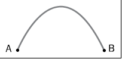
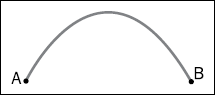

## JavaScript 和 HTML5的崛起

JavaScript的角色从一个简单的客户端语言逐渐占据了主导，成为创建和管理web用户界面的首选语言。然而十年之前，编程技术并不是这样。有一群开发人员，像Douglas Crockford 他的书《JavaScript: The Good Parts》(O'Reilly Medial/Yahoo Press)，使JavaScript成为更好的语言；Sam Stephenson，创建了prototype JavaScript库（http://www.prototypejs.org)，还有John Resig，JQuery库的作者，是他们把JavaScript带入到构建复杂Web前端软件的框架中。

介绍新的编程风格已经超出了本书的范围。然而，在本书中，我们将看到用JQuery写成的例子（因为Highcharts使用JQuery库作为默认选择，而且JQuery本身也是最流行的JavaScript框架）。期望读者对JQuery和CSS选择器的语法有基本的了解。此外，读者还应该熟悉在《JavaScript：The Good Parts》中讲到的JavaSCript进阶部分：原型（prototypes），闭包（closure），继承（inheritance），以及函数对象（function objects）。

### HTML5（SVG 和 canvas）

在这一节中，将介绍两个HTML5技术：SVG和canvas，以及几个例子。

#### SVG（Scalable Vector Graphics 可缩放矢量图）

HTML5是目前HTML标准的重大改进。采用HTML5技术的领域也迅速扩大（苹果移动设备不再支持Adobe Flash，也助长了HTML5的应用）。HTML5也带来了许多新的特性。许多新特性已经超出了本书的讨论范围，其中和本书关系最大的就是可缩放矢量图（SVG）。SVG是使用XML描述的数量图，由路径，文本，形状，颜色等组件组成。这和PostScript很像，不过PostScript是基于堆栈的编程语言。SVG的名字隐含了一个主要优点，就是无损技术（和PostScript相同）；不会因为图像的放大出现像素块，也不会因为缩小图片尺寸丢失原始内容。

此外，SVG可以使用SMIL（同步多媒体集成语言）编写动画脚本，进行事件处理。目前的主流浏览器都支持SVG技术。

下面是一个简单的例子，在两点之间画一个曲线：

	<svg xmlns="http://www.w3.org/2000/svg" version="1.1">
		<path id="curveAB" d="M 100 350 q 150 -300 300 0" stroke="blue"	stroke-width="5" fill="none" />
		<!-- Mark relevant points -->
		<g stroke="black" stroke-width="3" fill="black">
			<circle id="pointA" cx="100" cy="350" r="3" />
			<circle id="pointB" cx="400" cy="350" r="3" />
		</g>
		<!-- Label the points -->
		<g font-size="30" font="sans-serif" fill="black" stroke="none" textanchor="	middle">
			<text x="100" y="350" dx="-30">A</text>
			<text x="400" y="350" dx="30">B</text>
		</g>
	</svg>

上面的SVG代码，执行了这些操作：

1. 绘制一个路径，id为"curveAB"，数据为d。首先，移动（M）到坐标点（100，350），以此为起点，画一个贝塞尔二次曲线，过（150，-300）到（300，0）。
2. 组合（g）两个圆圈元素——点A和点B，以他们的坐标（100，350）和（400，350）为圆心，画一个半径为3像素的圆，然后填充黑色。
3. 组合（g）两个文本元素A和B，以（100，350）和（400，350）为起点，使用黑色sans-serif字体显示。并分别沿x轴（dx）向两边偏移30像素。

最后如图：

#### Canvas
Canvas是另外一个HTML5新标准，被一些JavaScript绘图软件使用。如它的名字，你需要使用`canvas`标签声明一块绘图区域，然后使用新的JavaScript API以像素为单位绘制线或者图形。Canvas没有内建对动画的支持，可以以顺序调用API的方式来模拟动画。另外，Canvas也不支持事件处理，开发者需要手动将事件处理句柄挂载到画布中的某个区域上。因此，一些花哨的图标动画的实现非常复杂。

下面是一段canvas代码，实现和前面SVG一样的效果：

	<canvas id="myCanvas" width="500" height="300" style="border:1px solid #d3d3d3;">Canvas tag not supported</canvas>
	

如你所见，Canvas和SVG完成同样的工作，canvas需要更多的代码： 

与SVG使用一个连续的路径描述不同，canvas使用了一系列调用JavaScript绘图方法。调用属性设置函数设置属性，而不在标签中声明属性。SVG主要是声明，而canvas则是运行程序。