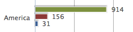
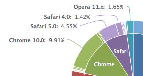
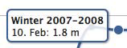
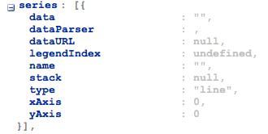
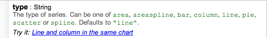
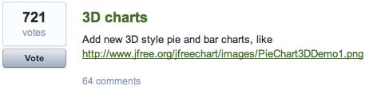

## 为什么选择Highcharts
虽然Highcharts仅有基本的2D图表，但是它提供了非常吸引人，看起来也非常专业的图表。产品立足于对于细节的投入，不仅仅是展示方面，还有下面提到的一系列说明。产品在2009年发布，由一个挪威公司开发，Highsoft Solutions AS是Torstein Hønsi创立的。Highcharts不是他们的第一个产品，但是是市场反响最好的一个。

### Highcharts 和 JavaScript框架
Highcharts虽然是基于JavaScript框架库的，但它的实现并不依赖于某一个流行的框架。Highcharts被封装为一个适配器，以便适应框架的接口。

因此，Highcharts可以和MooTools，Prototype或者jQuery框架结合在一起。这样用户不在需要在已经开发的产品中纠结使用哪个框架，他们可以选择最适合他们的框架。Highcharts使用jQuery作为默认的选择，用户在加载Highcharts之前先加载jQuery库即可。

在MooTools环境下使用Highcharts，可以这样引入脚本：

    
    
    

在Prototype下使用Highcharts，则需要这样引入：

    
    
    

### 演示效果
Highcharts寻求在视觉和感觉之间的平衡。图表赏心悦目而且风格简洁。借助于微妙的阴影和白色边框效果，默认的颜色也非常柔和，没有强烈的对比。黑色或者其他深色的坐标轴既没有文字，也没有其他的颜色，这使得用户的注意力可以集中在彩色的数据展示区。

Highcharts中所有的动画效果（初始化，更新，提示）都是平滑渐慢的效果。例如，环形图（多个数据序列的饼图）的初始化动画是最令人印象深刻的一个。Highcharts在这方面更好一些，其他的绘图动画过于机械，过于泛滥，有时甚至有些令人反胃。

提示框和图例（包含内外标签）是一个简单的圆角边框，既很好的融入了图标中，也不干扰用户的注意力。下面这只一个提示框的例子：

下面是两个数据图例的例子：

概括地说，每一个Highcharts元素都彼此竞争用户的注意力；他们和谐共处在同一张图表中。

### 许可证
Highcharts有免费的非商业许可证，也有商业许可证。免费的共同创造-署名-非商业3.0许可证（Creative Commons – Attribution NonCommercial 3.0）允许个人和非营利目的使用。Highcharts提供不同商业许可证用于不同的商业目的。他们有单一网站许可证，也有开发者许可证。对于web开发产品，开发者许可证比起另外两种许可证——按站点付费的许可证，高价OEM许可证更合适，因为：

*  对于软件公司，很容易从他们的开发计划中算出他们需要的许可证数量。
*  也不用担心已销售的拷贝会违反许可协议。
 
通常，开发者许可证不会无限制的一直使用最新版本。许可证之允许在购买日起一年内发布的版本。此后，开发者决定使用新版本的时候需要更新许可证。此外，OEM许可证是可以协商，通常，基于项目的开发者数量和部署数量。

### 简单API模型 
Highcharts有非常简单的API模型。创建图表时，构造API和通常的对象声明类似的方法设置必要的属性。Highcharts提供了一组小型的API，用于动态更新已有的图表。属性配置的细节，在第二章中有详细的描述。Highcharts的API将在第七章中讨论。

### 文档
Highcharts的在线文档非常出色。它不仅是简单的文档，还有所有的函数定义和例子。

文档页的左侧，是按照对象结构组织的，你可以用它来创建图表。你可以利用像JavaScript控制台这样的工具扩展对象的属性。这帮助开发者很自然地熟悉使用方法。

文档页的右侧，详尽的属性定义。每一个定义除了描述信息，还有一个在线示例，连接到jsFiddle网站。

jsFiddle快速示例允许用户尝试不同的属性设置，在图表中随即表现出来。因此整个文档的浏览过程非常高效和流畅。

### 开放（用户影响产品特性） 
Highcharts用一种非常规的方法决定哪些新特性放入主线发布（这个方法不同于常规的开源项目，但这是Highcharts优于其他项目的地方）。用户可以提交新的功能需求，然后为它们投票。公司评审哪些得票最高的功能需求，并制定新功能的发展计划。然后在其网站上公布这些计划的细节。
In addition, Highcharts is hosted on GitHub, an online public source control service,which allows JavaScript developers to contribute and clone their own versions.
此外，Highcharts托管在GitHub上，一个在线的公用源代码控制服务，允许JavaScript开发者克隆自己的版本，贡献代码。

