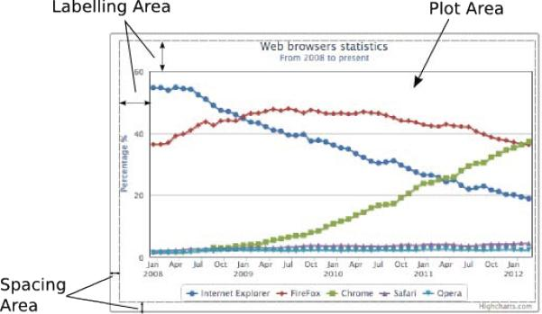
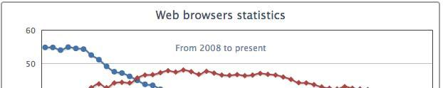
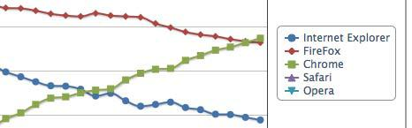

===================
了解图表布局(layout)
====================
-----------------------------------

在我们开始学习Highcharts布局如何工作之前，我们需要事先了解一些基础的概念。为此，让我们先来重新找出来第一章 网页图表中用过的例子并且给它设定一对边框。首先来给图形区域周围设定一组边框，为了设定，我们需要在chart中设定plotBorderWidth和plotBorderColor选项，如下：

    chart: {
      renderTo: 'container',
      type: 'spline',
      plotBorderWidth: 1,
      plotBorderColor: '#3F4044'
    },
  
第二组边框我们设定它围绕着图表的container卷标，所以我们扩展前面chart的部分增加额外的设定：

    chart: {
      renderTo: 'container',
      ....
      borderColor: '#a1a1a1',
      borderWidth: 2,
      borderRadius: 3
    },
  
基本上，这部分会将container标签的边框设定为2个像素的宽度及半径为3个像素的圆角表格。

如我们所看到，这个边框在container容器的外围，这个边框也是Highcharts所有元素所处的范围边界。

默认情况下，Highcharts会显示3个区域——间隔区域，卷标区域，图表区域。图表区域是在最内层的矩形部分，包含了所有的图表的图样。卷标区域则是在图表区域的外围，它包含了标题，副标题，轴标题，图例说明及版权说明的部分。间隔区域则是在容器的内部及卷标区域外部的这个部分，下面的图示标注了三种不同的区域，用灰色的虚线来区分间隔区域和卷标区域。

每一个标签的定位都可以使用下面的两种布局来处理：

+ 自动布局：Highcharts会依据卷标在卷标区域的位置来自动调整图表区域的大小，这意味着卷标无法显示在图表区域内（无法达成将卷标与图表重迭的效果），自动布局是一种很简单的配置方式，但是对图表的调整程度比较低。自动布局是Highcharts的默认布局方式。
+ 固定布局：这种布局中不再存在卷标区域这个区域，图表卷标是指定固定的位置，使卷标显示在图表区域最上层。换句话说，图表区域并不会依据卷标的位置来进行自动调整，这种方式可以让我们完全的控制图表应如何呈现。

间隔区域控制着Highcharts在各边界的偏移量。间隔区域是全局变量，如果图表没有定义边界大小(margin)，则增加和减少间隔区域会影响全部布局（自动或固定布局）。

====================
图表边界(margin)与间隔(spacing)
====================
-----------------------------------

在这一节中我们会看到设定边界与间隔在图表中所表现出来的效果。图表边界可以在属性margin, marginTop, marginLeft, marginRight和marginBottom中设定，默认状况下边界的属性并不会被设定。设定图表的margin属性在整个图表区域中是作为全局变量出现的。

margin属性可以是一个数组，比较类似css的方法，从上面开始顺时针计算其他的位置。此外margin的优先级比直接指定方向的margin优先级要低，优先级也不会因为在chart中出现的顺序比较靠前而提高。

Spacing的设定会在设定任何一个方向的spacing时自动开启，如设定属性spacingTop, spacingLeft, spacingBottom或spacingRight。

在本例中我们会为每一条边来增加或修改margin或spacing属性并观察其效果，下面是设定：

    chart: {
      renderTo: 'container',
      type: ...
      marginTop: 10,
      marginRight: 0,
      spacingLeft: 30,
      spacingBottom: 0
    },

下面是观察到的图表样子：

marginTop属性固定了图表区域的上边界距离容器的边框为10个像素的距离，同时它也使得布局变为了固定布局，因而图表的标题与副标题都会重迭显示在图表区域上了。spacingLeft属性增加了左边的间隔区域距离，因此可以进一步调整Y轴标签，这里因为是自动布局（没有声明marginLeft），所以也同步调整了左边的图表边框。设置marginRight为0则会覆盖右边的spacing属性，并将布局调整为固定布局模式。最后，设定spacingBottom为0让图例的部分放置到容器的底部。虽然spacingBottom设置为0，但是这部分仍然是自动布局，因此图表区域也会自动随着图例区域而延伸。

====================
图表卷标属性
====================
-----------------------------------

图表卷标如xAxis.title（X轴标签）, yAxis.title（Y轴标签）, legend（图例）, title（标题）, subtitle（副标题）, credits（网站说明，类似与power by的概念）公用一些相同的属性名，如下：

+ align: 水平对齐卷标，属性内容有left, center, right，在轴标签则有low, middle, high
+ floating: 让卷标具有在图表区域浮动(floating effect)显示。
+ Margin: 边界设定，只有某些卷标有此选项，用来设定卷标到图表边界的距离。
+ verticalAlign: 垂直对齐卷标，属性内容有top, middle, bottom
+ x: 水平对齐中的定位
+ y: 垂直对齐中的定位

在标签的x和y的定位，是用来调整标签在对齐中的位置，因此通常不会用在表达图表中的绝对寻址。下图表示坐标的方向，图中间位置为卷标的地方：

我们可以在一个简单的例子，如将图表中的标题与副标题放置在相邻的位置，以此来试验一下align属性和y的定位设定。

标题使用align设定为left，将其移动到左侧，然后将副标题align设定为right，将其移动到右侧。为了让标题与副标题可以在同一行显示，我们还要调整副标题的y定位属性到15，使之与标题默认的y定位呈现相同的高度。

    title: {
      text: 'Web browsers ...',
      align: 'left'
    },
    subtitle: {
      text: 'From 2008 to present',
      align: 'right',
      y: 15
    },

下图为标题与副标题在同一行上的效果：

在下面的一节中，我们会继续尝试修改各个不同的对象的卷标来观察其对应的效果。

====================
图表卷标属性
====================
-----------------------------------

标题和副标题具有相同的属性设定，唯一的差别为默认状况下标题具有margin的设定值。指定verticalAlign可以改变默认的自动布局为固定布局（内部会自动将floating修改为true）。然而手动设定副标题的floating属性为false并不会将其修改回自动布局，下面的例子是将标题设置为自动布局而副标题设置为固定布局：

    title: {
      text: 'Web browsers statistics'
    },
      subtitle: {
        text: 'From 2008 to present',
        verticalAlign: 'top',
        y: 60 
      },
      
副标题verticalAlign属性被设置为top，所以副标题的布局被转换为固定布局，并且将y定位设置为60个像素的高度，于是副标题的定位被向下移动。在此例中，标题仍然为自动布局，所以还在图表区域的上方，但副标题因为为固定布局，并且设定了固定位置为距离上边距60像素，因此它浮动于图表区域并重迭显示：

    *目前如果标题与副标题全部使用verticalAlign对齐时，highcharts还有一个bug，*
    *可以参考官网的bug报告*
    *http://github.com/highslide-software/highcharts.com/issues/962.*
    
====================
图例（legend）对齐
====================
-----------------------------------

图例对verticalAlign和align这两种属性具有不同的设置。除了设置对齐方式为center之外，其他的对齐方式设定仍为自动定位，下面使用一个图例靠右的例子，verticalAlign属性设置为middle，align设置为right

    legend: {
      align: 'right',
      verticalAlign: 'middle',
      layout: 'vertical',
    },
    
Layout的属性设定为vertical则图例框中的元素都是垂直显示，如下图，图表区域已经自动重设了图例框的尺寸：

====================
轴标题对齐
====================
-----------------------------------

轴标题无法使用verticalAlign属性，它使用align属性，即使属性的内容为low, middle或high(y轴的align)。轴标题的边界设定是设定轴标题和轴线之间的距离，下面的例子中会展示y轴的标题由垂直设定转为水平设定（默认情况下），会将轴标题显示在轴线的上面而不是边上，此外，我们使用y属性来调整标题的位置：

    yAxis: {
      title: {
        text: 'Percentage %',
        rotation: 0,
        y: -15,
        margin: -70,
        align: 'high'
      },
      min: 0
    },
    
下面图中的左上角可以看到图表中y轴的标题已经从边上移动到了y轴的上面，另一种方法为我们可以使用offset选项来代替margin达到相同的结果。

====================
credits（网站说明，类似与power by的概念）对齐
====================
-----------------------------------

credits与其他卷标元素的设定有一些不同，它只支持align, verticalAlign, x和y这四种属性在credits.position中(比较简单的写法为credits:{position:…})，同时它也不支持任何spacing的设定。假设我们有一个没有图例的图表，并且我们要移动credits到图表左下的部分，下面为我们的做法：

    legend: {
      enabled: false
    },
    credits: {
      position: {
        align: 'left'
      },
      text: 'RetailSCM',
      href: 'http://www.retailscm.com'
    },

然而，credits的text部分已经超出了图表的边界，如下图所示：

即使我们将credits标签移动到右边并设定x定位，但是标签还是有一些太过靠近x轴标签或x轴标题，我们在这里要特别额外介绍spacingBottom来在标签中设定间隔的部分，如下：

    chart: {
      spacingBottom: 30,
      ....
    },
    credits: {
      position: {
        align: 'left',
        x: 20,
        y: -7
      },
  
下图为调整之后的结果：

====================
尝试自动布局
====================
-----------------------------------

在这一节中，我们会测试自动布局的特性，在这个看起来比较简单的例子中，我们开始将图表标题与图表不在设定spacing的值：

    chart: {
      renderTo: 'container',
      // border and plotBorder settings
      .....
    },
    title: {
      text: 'Web browsers statistics,
    },

从前面的例子中，图表的标题应该如预期般出现在容器与图表区域之间的部分

标题和容器顶端边框的部分默认设定spacingTop为10像素高，标题和图表区域顶端边框的高度在默认设置title.margin为15个像素高。

如果设定spacingTop为0，则图表的标题会向上移动到容器的顶端边框，因此图表区域也会自动向上延展，如下图：

我们接着再将title.margin设置为0，于是图表的边框也向上移动，图表区域也会对应变得更高，如下图：

你也许有注意到了，目前顶部的边框和图表标题时间还是有几个像素的差距，这其实是因为标题上默认15个像素高度的y定位设定，足够默认大小字体的高度设定。

下面图表设定中设定了的容器与图表区域之间的大小为0

    chart: {
      renderTo: 'container',
      // border and plotBorder settings
      .....
      spacingTop: 0
    },
    title: {
      text: 'Web browsers statistics',
      margin: 0,
      y: 0
    }

如果我们设定title.y为0，图表顶端的边界和容器顶端的边界将重合，下面图为最终效果，图表的标题已经因为移到了容器边框之外，所以已经看不到了。

有趣的是，如果我们回到第一个例子中，图表区域顶边与容器顶边默认的距离是按照如下公式计算的：

spacingTop + title.margin + title.y = 10 + 15 + 15 = 40

因此改变任何这三个变量中的一个都会使图表区自动调整与容器顶边的距离。这些偏移量在自动布局中都有他们不同的作用。

Spacing是用来控制容器与图表之间的距离，如果我们希望控制图表具有比较大的空间，就可以使用这个属性来控制。同样，如果我们希望改变卷标字体的大小，则应该考虑调整y定位属性。设定卷标在图表中的这些属性并不会影响到其他的组件。

====================
尝试固定布局
====================
-----------------------------------

在上一节中我们了解到如何让图表进行动态的自动调整，在这一节中我们会来看一下如何手动调整图表卷标的位置。首先，我们再拿上一节的示例代码来使用，并将其中图表卷标的verticalAlign属性修改为bottom，如下：

    chart: {
      renderTo: 'container',
      // border and plotBorder settings 
      .....
    },
    title: {
      text: 'Web browsers statistics',
      verticalAlign: 'bottom'
    },

图表标题移动到了图表的底部，紧贴着容器的底边。注意此设定会将标题修改为floating模式，其他更重要的设定在图表区域中则仍然保持为自动布局：

要注意的是我们并没有设置spacingBottom属性，但是会默认设定15个像素的高度，因为在title.y的默认值是15，这也意味着标题和容器底边会有15个像素的距离。按照之间图表卷标属性一节中所提到的例图中，y的正值会将标题向容器底部方向执行位移。

让我们来将y的位移做一个大一点的设定，这样我们就可以看到verticalAlign的设定使标题浮动在图表上。

    title: {
      text: 'Web browsers statistics',
      verticalAlign: 'bottom',
      y: -90
    },

y的负值会将标题向容器顶部的方向进行位移，如图：

现在标题和图表是重迭的，这意味着标签可以在自动布局中向图表移动，这里我们改变了卷标的y属性和边距设定，我们在轴标签上增加一个距离：

    legend: {
      margin: 70,
      y: -10
    },

这样会向上提升图表的底边，然而图表标题仍然保留为固定布局并且其在图表中的位置也没有因为轴标签的新设定而做了任何的改变，如图：

到目前为止，我们已经可以更好的理解如何对卷标元素进行定位及他们的布局策略与图表之间的关系了。
