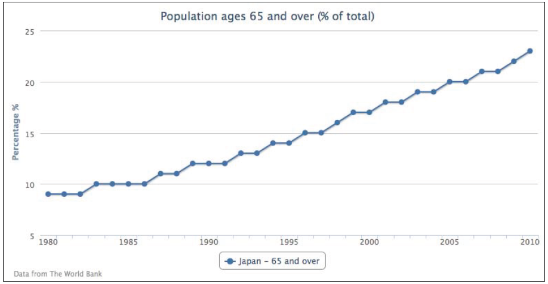

3 
===================
线，面和散点图
====================
  在这一章中，我们将通过对线，面和散点图的绘图选项的细致探索，来进一步学习。
  我们还会学习如何创建**叠加图表**和 **投影图表**。然后尝试画出一些略有艺术样式的图表。
  以使我们有机会利用更多的绘图选项。这一章内容包括：
  
+  折线图介绍
+  面积图素描
+  折线图和面积图结合
+  散点图和面积图结合
**********************************************************

 折线图介绍
 -----------------
 
   从单一一个折线图表开始.选用World Bank
   组织（www.worldbank.org)提供的众多数据中的一个。下面的代码片段创建了一个简单的折线图，表现了日本过去三十年中65岁以上人口的百分比：
 
    var chart = new Highcharts.Chart({
        chart: {
            renderTo: 'container'
        },
        title: {
        text: 'Population ages 65 and over (% of total)',
        },
        credits: {
        position: {
            align: 'left',
            x: 20
        },
        text: 'Data from The World Bank'
        },
        yAxis: {
        title: {
        text: 'Percentage %'
        }
        },
        xAxis: {
            categories: ['1980', '1981',
            '1982', ... ],
            labels: {
            step: 5
            }
        },
        series: [{
            name: 'Japan - 65 and over',
            data: [ 9, 9, 9, 10, 10, 10, 10 ... ]
        }]
    });
    
    如下图：

 </img>
