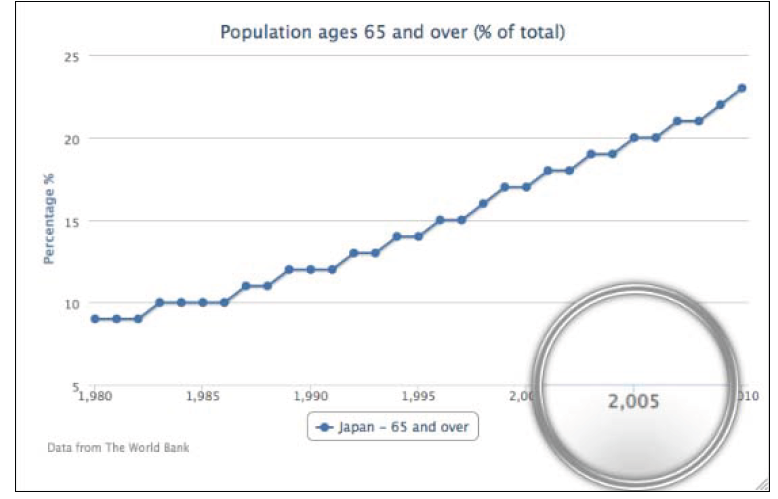

03.01
=========================
折线图介绍
===============================
 
   从单一一个折线图表开始.选用World Bank
   组织（www.worldbank.org)提供的众多数据中的一个。下面的代码片段创建了一个简单的折线图，表现了日本过去三十年中65岁以上人口的百分比：

     var chart = new Highcharts.Chart({
    chart: {    
      renderTo: 'container'    
    },    
    title: {    
      text: 'Population ages 65 and over (% of total)',    
    },    
    credits: {    
      position: {    
      align: 'left',    
      x: 20    
    },    
    text: 'Data from The World Bank'    
    },    
    yAxis: {    
    title: {    
    text: 'Percentage %'    
    }    
    },    
    xAxis: {    
    categories: ['1980', '1981',    
    '1982', ... ],    
    labels: {    
    step: 5    
    }    
    },    
    series: [{    
    name: 'Japan - 65 and over',    
    data: [ 9, 9, 9, 10, 10, 10, 10 ... ]    
    }]    
    });    
    
    如下图：

 </img>

除了在 *categories*属性中手动定义年份，还可以使用 *series*中的 *pointStart*选项来初始化x轴的第一个点的值。因此我们在 *xAxis*中无任何配置但在seies中定义了 *pointStart*，代码如下：

    xAxis：{    
    },    
    series: [{
        pointStart : 1980, 
        name: 'Japan - 65 and over',    
        data: [ 9, 9, 9, 10, 10, 10, 10 ... ]
    }]    

虽然这是个简化的例子，x轴的标签会自动匹配数据通过 *Highcharts*的 *numberFormat*方法，这样使得在每个三位数字（大于1000的数字）后加上一个逗号，下面是x轴的具体输出：

</img>

为了解决这个问题，我们需要重写标签的 *formatter*选项，这很简单，只要返回一个标签值来绕开默认 *numberFormat*方法的调用就可以了。 **此外，还需要将 *allowDecimal*选项置为false**.因为，当调整图表大小时会延长x轴，小数就会显示出来。

下面是使用 *pointStart*来控制x轴年份值得最终版本：

    xAxis: {     
     labels:{     
     formatter: function() {     
     // 'this' keyword is the label object     
     return this.value;     
     }     
     },     
     allowDecimals: false     
     },     
     series: [{     
     pointStart: 1980,     
     name: 'Japan - 65 and over',     
     data: [ 9, 9, 9, 10, 10, 10, 10 ... ]     
     }]     
