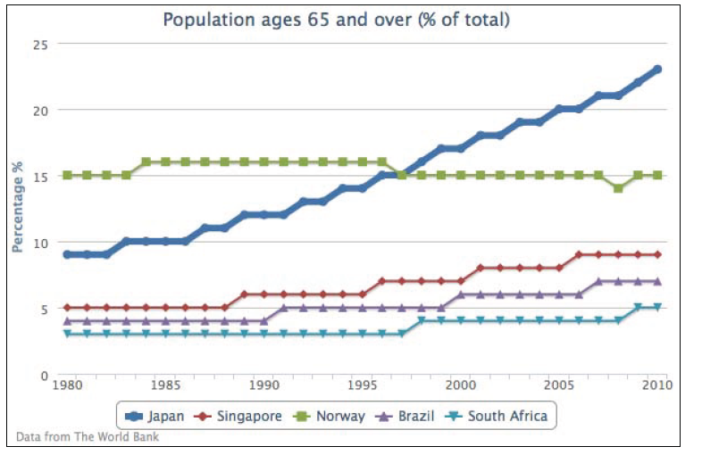
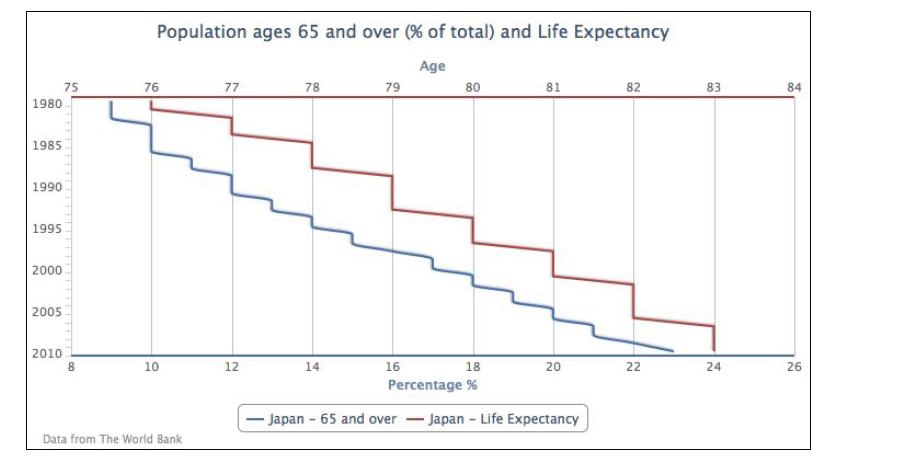
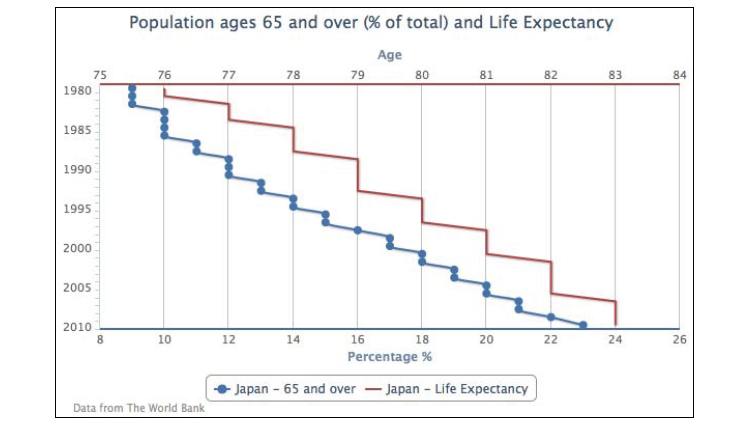

03.01
=========================
折线图介绍
===============================
 ----------------------------
   从单一一个折线图表开始.选用World Bank
   组织（www.worldbank.org)提供的众多数据中的一个。下面的代码片段创建了一个简单的折线图，表现了日本过去三十年中65岁以上人口的百分比：

     var chart = new Highcharts.Chart({
    chart: {    
      renderTo: 'container'    
    },    
    title: {    
      text: 'Population ages 65 and over (% of total)',    
    },    
    credits: {    
      position: {    
      align: 'left',    
      x: 20    
    },    
    text: 'Data from The World Bank'    
    },    
    yAxis: {    
    title: {    
    text: 'Percentage %'    
    }    
    },    
    xAxis: {    
    categories: ['1980', '1981',    
    '1982', ... ],    
    labels: {    
    step: 5    
    }    
    },    
    series: [{    
    name: 'Japan - 65 and over',    
    data: [ 9, 9, 9, 10, 10, 10, 10 ... ]    
    }]    
    });    
    
    如下图：

 </img>

除了在 *categories*属性中手动定义年份，还可以使用 *series*中的 *pointStart*选项来初始化x轴的第一个点的值。因此我们在 *xAxis*中无任何配置但在seies中定义了 *pointStart*，代码如下：

    xAxis：{    
    },    
    series: [{
        pointStart : 1980, 
        name: 'Japan - 65 and over',    
        data: [ 9, 9, 9, 10, 10, 10, 10 ... ]
    }]    

虽然这是个简化的例子，x轴的标签会自动匹配数据通过 *Highcharts*的 *numberFormat*方法，这样使得在每个三位数字（大于1000的数字）后加上一个逗号，下面是x轴的具体输出：

</img>

为了解决这个问题，我们需要重写标签的 *formatter*选项，这很简单，只要返回一个标签值来绕开默认 *numberFormat*方法的调用就可以了。 **此外，还需要将 *allowDecimal*选项置为false**.因为，当调整图表大小时会延长x轴，小数就会显示出来。

下面是使用 *pointStart*来控制x轴年份值得最终版本：

    xAxis: {     
     labels:{     
     formatter: function() {     
     // 'this' keyword is the label object     
     return this.value;     
     }     
     },     
     allowDecimals: false     
     },     
     series: [{     
     pointStart: 1980,     
     name: 'Japan - 65 and over',     
     data: [ 9, 9, 9, 10, 10, 10, 10 ... ]     
     }]     

扩展到多个系列的折线图
==================

下面我们新增加几个系列折线，并把日本的折线增加到6个像素宽，代码如下：

    series: [{
        lineWidth: 6,
        name: 'Japan',
        data: [ 9, 9, 9, 10, 10, 10, 10 ... ]
        }, {
        Name: 'Singapore',
        data: [ 5, 5, 5, 5, ... ]
        }, {
        ...
        }]

日本系列的人口折线变成了图标中的焦点，如下截图：

</img>

向更加复杂的折线图前进！为了展示颠倒的折线图，使用 *chart.inverted* 选项将y轴和x轴置为相反的方向。
然后改变坐标轴的颜色匹配相同系列的颜色。同时，禁用了所有系列的数据点标记，最后添加 *yAxis：1* 属性用来 使第二个系列坐标轴与第二个y轴数组数据匹配，这样就得到了上下两个不同颜色，不同刻度的“y”（其实是颠倒后的y）坐标轴，如下：

    chart: {
        renderTo: 'container',
        inverted: true,
        },
        yAxis: [{
            title: {
                text: 'Percentage %'
            },
        lineWidth: 2,
        lineColor: '#4572A7'
        }, {
        title: {
            text: 'Age'
        },
        opposite: true,
        lineWidth: 2,
        lineColor: '#AA4643'
        }],
        plotOptions: {
            series: {
                marker: {
                    enabled: false
                    }
                }
            },
        series: [{
            name: 'Japan - 65 and over',
            type: 'spline',
            data: [ 9, 9, 9, ... ]
            }, {
            name: 'Japan - Life Expectancy',
            yAxis: 1,
            data: [ 76, 76, 77, ... ]
            }]

下面是颠倒过后并有两个“y”轴的图标：

</img>

上图中数据的表示看起来可能有点奇怪，因为我们把通常的时间标签交换成到了y轴并且数据的走势不便于理解。其实 *inverted* option 一般是用来展示不连续的数据格式或用于柱状图中。我们从上图中获取的信息是这样的：
12%的日本人口在65岁及以上，1990年的平均寿命是79岁。

同过设置 *plotOptions.series.marker.enabled* 为 *false* 可以关闭所有数据点的标记，如果想为一个特定的系列展示数据点标记，可以关闭全局的标记并打开那个特定系列的标记属性，或者其他方式

    plotOptions: {
        series: {
            marker: {
                enabled: false
            }
        }
    },
    series: [{
        marker: {
            enabled: true
        },
        name: 'Japan - 65 and over',
        type: 'spline',
        data: [ 9, 9, 9, ... ]
    }, {

下面的图表展示了只有65及以上年龄的系列有数据点标记：

</img>

本章结束咯~
