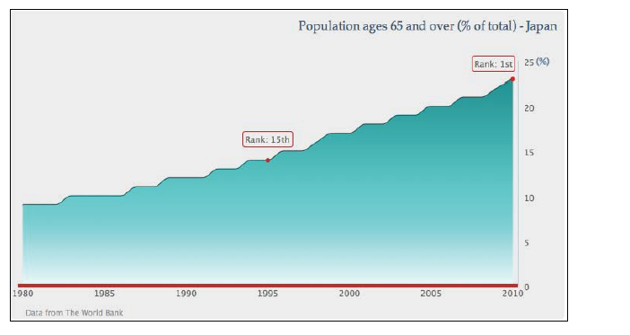

03.02
===========================
绘制面积图
===========================
 --------------------------
 在这一部分，我们会将本章中第一个例子修改成一个更加有格调的面积样条图表。
 结合使用 *area* 和 *spline* 属性将会生成*area spline
 chart*，主要的数据线被绘制成一个样条曲线，其下的区域被渐变且有透明效果的相似颜色填充。
 如图：

 

现在开始实现它吧！
首先，我们希望图表的观察者能够方便的看到当前趋势的数值，所有我们将y轴移动到最近年份（2010)的旁边,也就是说放到了图表的对面一侧：

    yAxis:{
        oppsite:true
        }

接下来，移除间隔线，并调整y轴轴线的宽度，获得一个较细的轴线：
    
    yAxis:{
        gridLineWidth:0,
        lineWidth:1
        }

然后用百分比标识（%）定义y轴的标题，并使之与轴线顶部对齐：

    yAxis:{
        title:{
            text:'(%)',
            rotation:0,
            x:10,
            y:5,
            align:'high'
            },
        }

至于x轴，我们使用红色加粗轴线，并删除轴线上的时间刻度：

    xAxis:{
        lineColor:'#CC2929',
        lineWidth:4,
        tickWidth:0,
        offset:2
        }

对于标题，将其移动到图表的右侧，增加标题与图表的空白，并设置一个不同的字体：

    title:{
        text:'Population ages 65 and over (% of total)- Japan ',
        margin:40,
        align:'right',
        style:{
            fontFamily:'palatino'
            }
        }

在以上设置之后，我们开始修改全部系列的表现形式，首先将 *chart.type* 属性由 'line' 改为
'areaspline'.要注意的是，在 series 对象中设置这个属性会覆盖plotOptions.series中定义的
*plotOptions.areaspline*属性.

由于现在图表中只有一个系列，所以没有必要显示样例表(legend box),使用 *showInLegend*
属性删除它吧！
接下来使图表变漂亮些，使用渐变的颜色填充面积区域，并为样条线设置一个比较暗的颜色：

    series: [{
        showInLegend: false,
        lineColor: '#145252',
        fillColor: {
        linearGradient: {
        x1: 0, y1: 0,
        x2: 0, y2: 1
        },
        stops:[ [ 0.0, '#248F8F' ] ,
                [ 0.7, '#70DBDB' ],
                [ 1.0, '#EBFAFA' ] ]
        },
    data: [ ... ]
    }]
    

之后，我们沿着曲线引入一对数据标签，以表明老年人口的排名随着过去的时间而增长.使用系列数据数组中对应1995和2010年的数据，并转换数字值为数据点对象。由于我们只想呈现这两年的数据点，所有在全局上关闭了
*plotOptions.series.marker.enabled* 属性并在数据点对象中的样式设置中个别的开启标识点：

    plotOptions: {
        series: {
        marker: {
        enabled: false
        }
        }
    },
    series: [{ ...,
        data:[ 9, 9, 9, ...,
            { marker: {
                radius: 2,
                lineColor: '#CC2929',
                lineWidth: 2,
                fillColor: '#CC2929',
                enabled: true
                },
            y: 14
        }, 15, 15, 16, ... ]
    }]

接下来，我们为数据标签绘制一个外边框，外边框为一个圆角(borderRadius)红色(borderColor)矩形。
使用x或y
选项可以很好的调整数据标签的位置。最后，我们更改数据标签的默认格式方法，使之返回人口在国家中的排名而不是数据点的值：

    series: [{ ...,
        data:[ 9, 9, 9, ...,
            { marker: {
                ...
            },
            dataLabels: {
                enabled: true,
                borderRadius: 3,
                borderColor: '#CC2929',
                borderWidth: 1,
                y: -23,
                formatter: function() {
                    return "Rank: 15th";
                }
            },
            y: 14
        }, 15, 15, 16, ... ]
    }]

最后一项操作时为图表应用一个灰色背景并增加底部空白(spacingBottom),spacingbottom额外的空白是为了避免credit
lable(Highcharts.com) 与x轴lable太过靠近，因为我们禁用了图例表(legend box)。

    chart:{
        renderTo:'container',
        spacingBottom:30,
        backgroundColor:'#EAEAEA'
        } 
    

当所有的配置都设置好后，就会显示出本节开头的截图了~！

