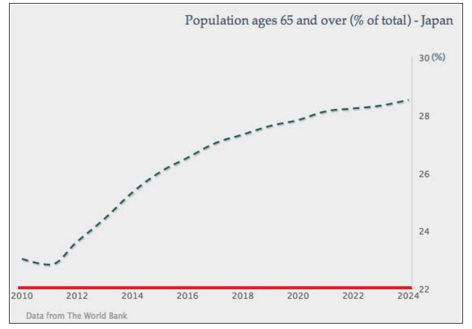
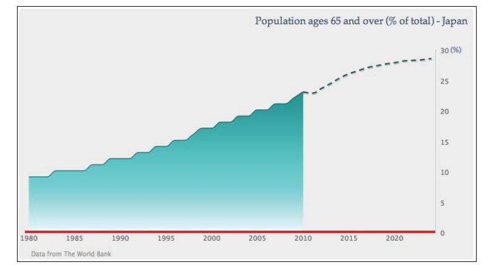
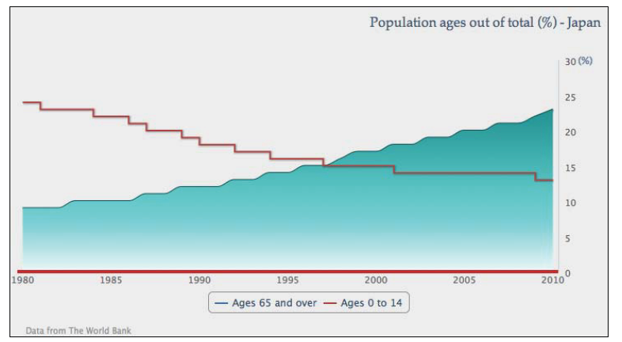
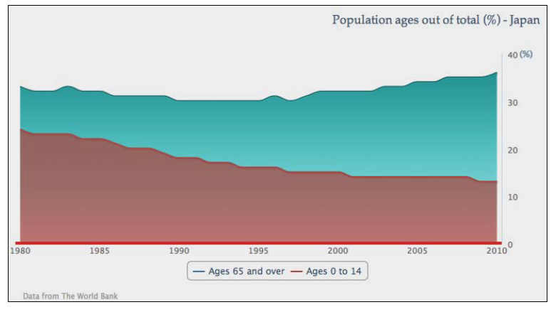
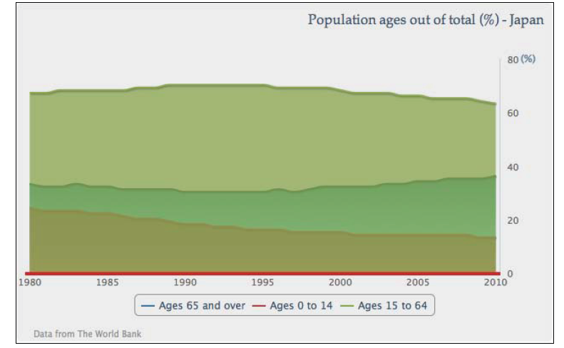
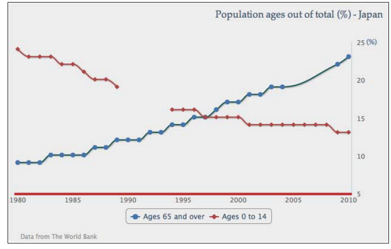
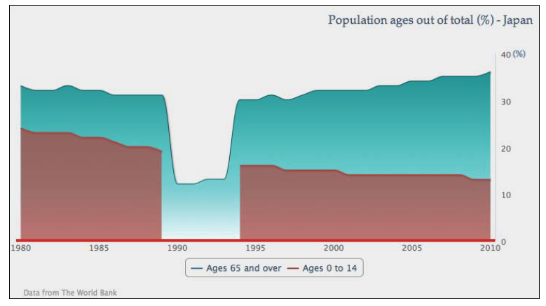
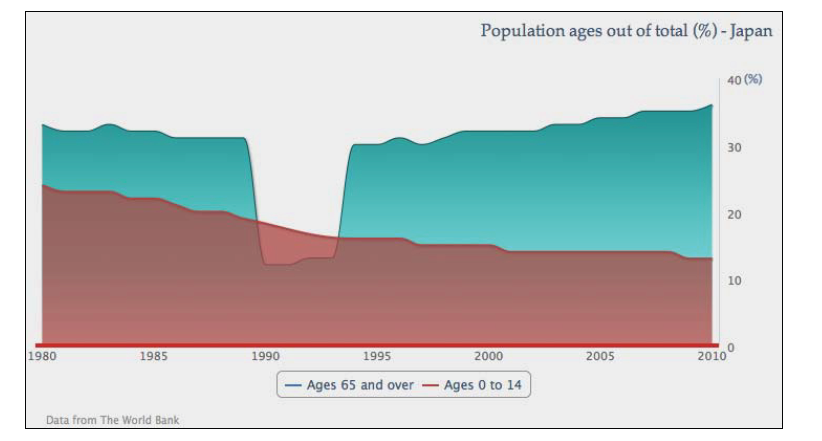

混合折线和面积图
============================
在这一部分中我们将探索将不同的类型图综合在一起，即混合折线和面积图：

* 投影图
* 混合区域样条图和步进线图
* 研究堆叠区域样条图，将两个区域样条系列从上部累加

模拟一个投影图
-------------------------

投影图分为使用真实数据的区域样条部分和投影数据的虚线延续部分。所以我们将数据分为两个系列，一个是真实数据，另一个是投影数据。下面是系列配置的代码。数据基于国家研究所的人口和社会安全研究报告(http://www.ipss.go.jp/pp-newest/e/ppfj02/ppfj02.pdf).

    series: [{
        name: 'project data',
        type: 'spline',
        showInLegend: false,
        lineColor: '#145252',
        dashStyle: 'Dash',
        data: [ [ 2010, 23 ], [ 2011, 22.8 ],
                ... [ 2024, 28.5 ] ]
    }]
    
未来的系列配置为样条虚线，并且禁用了图例，因为我们想将这两个系列呈现为同一个系列，即一个真实数据，一个未来投影数据。设置未来系列用颜色与第一个系列相同，最后一部分结构化了数据。由于我们用
*pointStart*
属性定义了x轴，所以需要对齐2010年后的投影数据。下面有两个途径定义时间数据为连续的形式，如下：

* 为第二个系列输入null值，用以对齐真实数据
* 用元组定义第二系列，包括时间和投影数据

下面使用第二种途径，因为呈现比较简单。下面是未来数据系列的截图：

</img>

真实数据系列与 *描绘面积图标*
章节开始的图例基本一致，除了没有数据点标记和数据标签装饰。下一步就是联合两个系列，如下：

    series: [{
        name: 'real data',
        type: 'areaspline',
        ....
    }, {
        name: 'project data',
        type: 'spline',
        ....
    }]
    

由于两个系列的数据没有交叠，因此产生一个平滑的投影图标：

</img>

样条线和步进折线对比
------------------------------
在这部分中我们将要绘制区域样条线和另一个步进折线。步进折线是水平和垂直走向的，仅仅按照数据的变化产生变化。通常用来展现离散的数据，即数据不是连续平缓的变动。

为了展示步进折线，继续使用第一个区域样条图例。首先，移除 *showInLegend* 和 *dataLables*
属性以便显示图例和数据标签。

接下来加入一个新的系列，*年龄0-14* ，样式为默认折线。然后修改为步进。下面是配置的代码：

    series: [{
        name: 'Ages 65 and over',
        type: 'areaspline',
        lineColor: '#145252',
        pointStart: 1980,
        fillColor: {
        ....
    },
        data: [ 9, 9, 9, 10, ...., 23 ]
        }, {
        name: 'Ages 0 to 14',
        // default type is line series
        step: true,
        pointStart: 1980,
        data: [ 24, 23, 23, 23, 22, 22, 21,
                20, 20, 19, 18, 18, 17, 17, 16, 16, 16,
                15, 15, 15, 15, 14, 14, 14, 14, 14, 14,
                14, 14, 13, 13 ]
    }]
   
下面是步进折线样式截图；

</img>

扩展到一个堆叠面积图
-----------------------------

这一章节中我们会把两个系列转变为面积样条线，并将他们从上部堆叠在一起，创建一个堆叠面积图。
 我们能够粗略的观察到个体数量，比例和总幅度。

 让我们来把第二个系列改为另一个 *areaspline* 类型吧：

    name: 'Ages 0 to 14',
    type: 'areaspline',
    pointStart: 1980,
    data: [ 24, 23, 23, ... ]
    

将 *stacking* 选项设为 'normal' 做为 *areaspline*的默认设置，如下：

    plotOptions:{
        areaspline:{
            stacking:'normal'
        }
    }

这样就使得两个面积图由上部互相堆叠起来。通过此举，我们可以观察到两个年龄组的人口互相补偿达到总人口的33%左右，而65岁及以上的年龄组将会在稍后阶段快速增长。

</img>

设想下，如果有三组面积样条线，但我们只想将其中两个叠加。（尽管使用柱状图比这样更加清晰）正如在
*探索绘图选项* *Highcharts 配置*  第2章节中所述，我们可以在 *plotOptions.series* 中设置
*stacking='normal'* ，然后人工关闭第三个系列的 *stacking* 配置，下面是具体的配置方法：

    plotOptions:{
        series:{
            marker:{
                enable:false
                },
                }
            },
            series:[{
                name:'Ages 65 and over'
                ....
                },{
                name:'Ages 0 to 14',
                ....
                },{
                name:'Ages 15 to 64',
                type:'areaspline',
                pointStart:1980,
                stacking:null,
                data:[67,67,68,68,....]
                }]

这样就利用第三个系列15-64年龄组生成了一个面积样条图，并覆盖到了前两个堆叠系列，如下：

</img>

绘制有缺失数据的图表
----------------------------

当一个系列有缺失的数据时，Highcharts会默认将其显示为间断的线。而 *connectNulls*
选项可以令折线连续即使这个系列中有缺失的数据。这个选项的默认值是 *false*
。设置两个存在空数据的样条线系列来检验一下其默认动作。此外，我们令数据标记可用，以便能够清晰的观察到缺失的数据点。

    series: [{
        name: 'Ages 65 and over',
        connectNulls: true,
        ....,
        // Missing data from 2004 - 2009
        data: [ 9, 9, 9, ...., 23 ]
    }, {
        name: 'Ages 0 to 14',
        ....,
        // Missing data from 1989 - 1994
        data: [ 24, 23, 23, ...., 13 ]
    }]
    

下面的图表通过样条线呈现了缺失的数据点的两种样式：

</img>

正如我们所看到的年龄0-14系列具有明显的间断，而65岁及以上系列配置 *connectNulls* 选项为
true，就将缺失的数据点用样条曲线连接起来了。如果数据标记不可用，我们就不能注意到这样的差别。

然而，我们应该小心使用这个选项，并特别注意在使用
*stacking*选项时不要使其可用。设想下，我们有两个叠加的面积图，其中只有在底部的年龄0-14系列有缺失的数据。那么程序对缺失数据的默认动作会令图表看上去如下图：

</img>

尽管底部的系列显示了缺失间断的部分，总体的堆叠图也是正确的。在同一区域的上层系列下降至单一系列值，整体的比例也保持不变。
问题所在是当 *connectNulls*
为true时，没有注意到系列中有缺失的数据，结果将是前后矛盾的图表，如下：

</img>

底部的系列覆盖了上部系列留下的空白部分，使堆叠图的整体比例失调。
~~EOF~~
