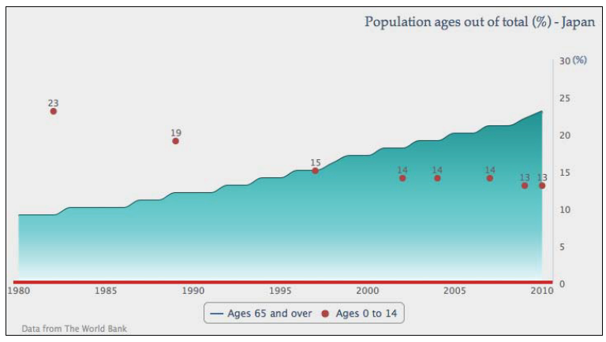
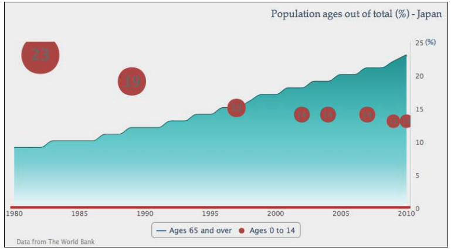
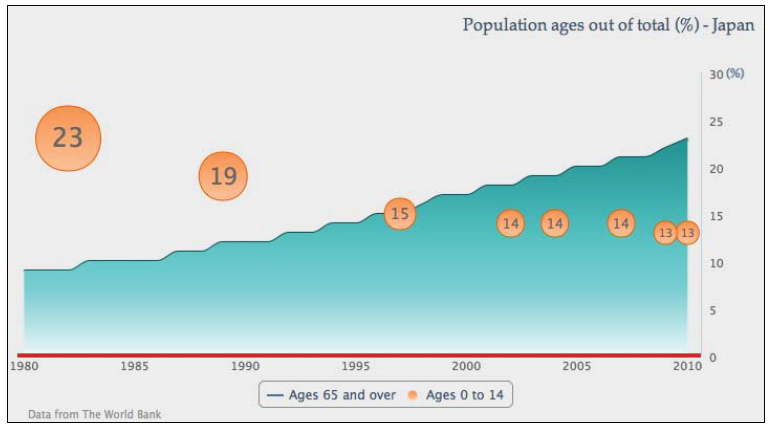
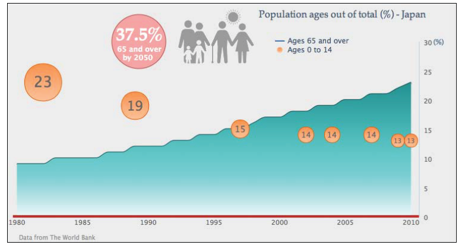

#离散和面积系列组合

Highcharts也支持散列图表用以绘制数据的走势。在这里我们使用不同的离散系列使我们的图表有点像一张海报。

首先，我们使用0-14年龄组数据的一个子集，并设置 *scatter* 类型：

    name: 'Ages 0 to 14',
    type: 'scatter',
    data: [ [ 1982, 23 ], [ 1989, 19 ],
            [ 2007, 14 ], [ 2004, 14 ],
            [ 1997, 15 ], [ 2002, 14 ],
            [ 2009, 13 ], [ 2010, 13 ] ]
   

接下来设置离散系列数据标签可用，并确保标记形状一直为 *'circle'* ，如下：

    plotOptions: {
        scatter: {
            marker: {
                symbol: 'circle'
            },
            dataLabels: {
                enabled: true
            }
        }
    }
    

前面的代码片段给了我们以下图：

</img>

    Highcharts提供了一系列的标记符号，并支持用户使用他们自己提供的标记图标（见第二章，Highcharts配置）。支持的标记符号有：圆形，正方形，菱形，三角形和倒三角.

##艺术打磨

下一步使用 *radius*
属性将每个散列的点打磨成气泡样式，并手动设置数据标签的字体大小与数据成比例。

    plotOptions: {
      scatter: {
        marker: {
            symbol: 'circle'
        },
        dataLabels: {
            enabled: true,
            verticalAlign: 'middle'
        }
      }
    },
    data: [ {
        dataLabels: {
            style: {
                fontSize: '25px'
            }
        },
        marker: { radius: 31 },
        y: 23,
        x: 1982
        }, {
        dataLabels: {
            style: {
                fontSize: '22px'
            }
        },
        marker: { radius: 23 },
        y: 19,
        x: 1989
    }, .....

下面的截图显示了数据点序列随着百分比数值的变化，从一个大的标记和字体逐渐变得小：

</img>

上面的图仍有两个问题。1.离散系列的颜色与标记中灰色的文本标签不协调导致难以分辨。

为了解决这一问题，我们用如下梯度设置将离散系列改为更清爽的颜色。

    color: {
        linearGradient: { x1: 0, y1: 0, x2: 0, y2: 1 },
        stops: [ [ 0, '#FF944D' ],
                 [ 1, '#FFC299' ] ]
    },

然后在 *plotOptions* 中为离散点设置一个比较深的轮廓，如下：

    plotOptions: {
        scatter: {
            marker: {
                symbol: 'circle',
                lineColor: '#E65C00',
                lineWidth: 1
            },

第二个问题是，数据点在坐标轴结束时被阻断。这个问题可以通过增加两个坐标轴额外的空白解决：

    yAxis: {
        .....,
        maxPadding: 0.09
    },
    xAxis: {
        .....,
        maxPadding: 0.02
    }

以下是新的图表一览:

</img>

下一部分我们会新增一个logo和一些装饰的文字。向图表引入图片有两种途径：

1. *plotBackgroundImage* 选项
2. *renderer.image* API 调用

*plotBackgroundImage* 会将整个图片设为图表的背景，这并不是我们打算要做的。

*renderer.image* 方法在图片位置和大小的控制上提供了更多。下面是当创建好图表后的调用：

    var chart = new Highcharts.Chart({
        ...
    });
    chart.renderer.image('logo.png', 240, 10, 187, 92).add();

*logo.png*
是logo图片文件的路径，接下来的两个参数是logo将显示在图表中的x和y的位置（从0开始，0是左上角）；最后两个参数是图片文件的宽度和高度。
*image* 主要返回一个元素对象，而后面的 *.add* 将返回的图片对象放入到 *renderer* 中。

至于装饰的文字，样式为一个红色圆圈中的大小不同的白色加粗文字。他们都是通过
*renderer* 创建的。下面的程序片段中第一个 *renderer*
的调用创建了一个红色的圆圈，x和y的位置以及半径。然后直接通过 *attr*
方法设置SVG属性。接下来的三个renderer调用用来创建晕圈中的文字，使用了css方法设置字体大小，样式和样色。我们还会在第七章-
*Highcahrts APIs* 中再次见到 *charts.renderer* 方法。

    // Red circle at the back
    chart.renderer.circle(220, 65, 45).attr({
        fill: '#FF7575',
        'fill-opacity': 0.6,
        stroke: '#B24747',
        'stroke-width': 1
    }).add();
    // Large percentage text with special font
    chart.renderer.text('37.5%', 182, 63).css({
        fontWeight: 'bold',
        color: #FFFFFF',
        fontSize: '30px',
        fontFamily: 'palatino'
    }).add();
    // Align subject in the circle
    chart.renderer.text('65 and over', 184, 82).css({
        'fontWeight': 'bold',
    }).add();
    chart.renderer.text('by 2050', 193, 96).css({
        'fontWeight': 'bold',
    }).add();

最后我们将图例（legend box）移到图表的顶部。为了将图例定位到绘图区域，我们需要设置
*floating*
属性为true，这样会强制图例为固定布局模式。然后移除默认的边框线，并设置图例中的条目垂直排列：

    legend: {
        floating: true,
        verticalAlign: 'top',
        align: 'center',
        x: 130,
        y: 40,
        borderWidth: 0,
        layout: 'vertical',
    },

下面是加上装饰后的最终效果(不错吧？)：

</img>

~~EOF~~
