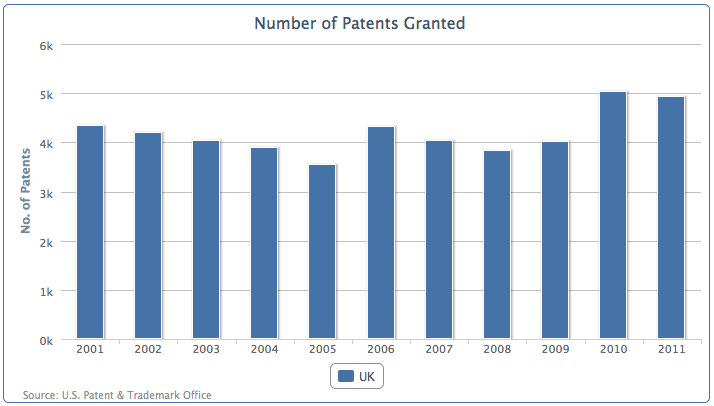
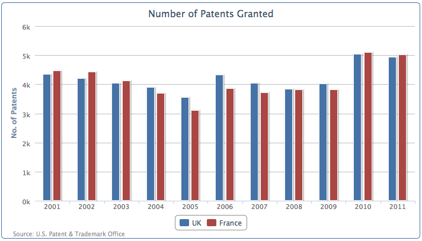
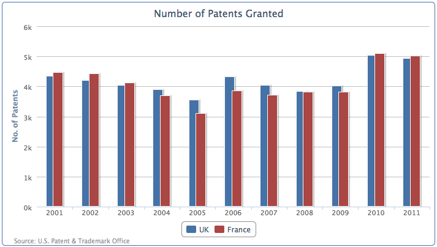
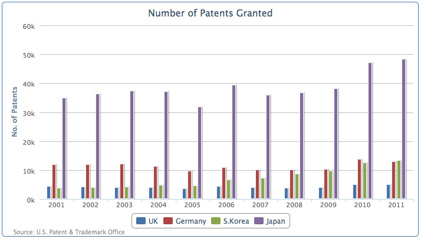
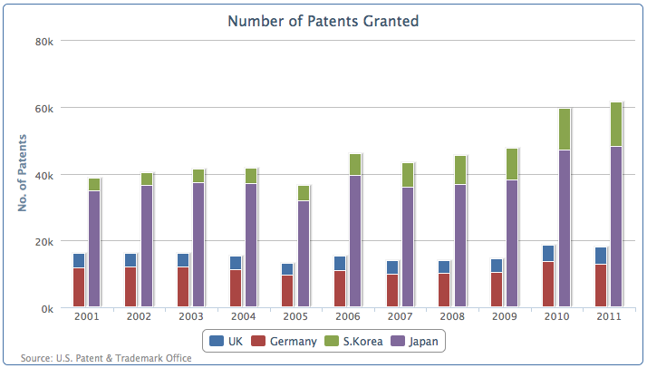
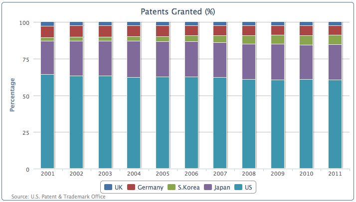
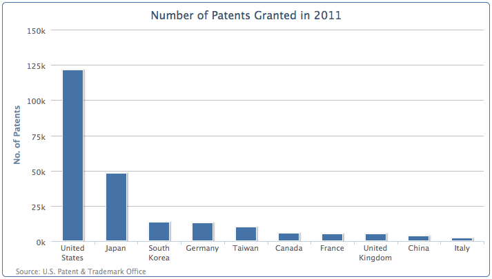
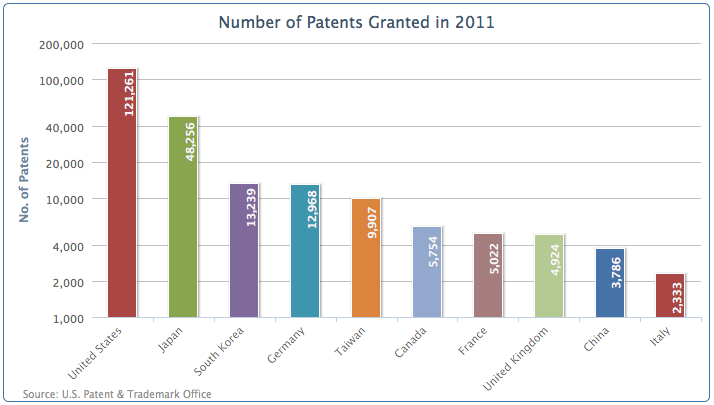

## 柱状图介绍

柱形图和条形图的区别很小。水平方向的称之为条形图，垂直方向的则为柱状图。柱形图和条形图通常用将数据的分类沿X轴绘制数据。在这一节我们绘制柱形图。我们将要使用由美国专利和商标局提供的数据。代码片段后面的柱状图展示了在过去的 10 年英国的专利数目。图表配置代码如下:

'''
    chart: {
        renderTo: 'container',
            type: 'column',
            borderWidth: 1
        },
        title: {
            text: 'Number of Patents Granted',
        },
        credits: { 
           position: {
              align: 'left',
              x: 20
           },
           href: 'http://www.uspto.gov',
           text: 'Source: U.S. Patent & Trademark Office'
        },
        xAxis: {
            categories: [ 
                '2001', '2002', '2003', '2004', '2005', 
                '2006', '2007', '2008', '2009', '2010',
                '2011' ]
        },
        yAxis: {
            title: {
                text: 'No. of Patents'
            }
        },
        plotOptions: {
        },
        series: [{
            name: 'UK',
            data: [ 4351, 4190, 4028, 3895, 3553, 
                    4323, 4029, 3834, 4009, 5038, 4924 ]
        }]

'''

从上面的代码，可以得到下面这样一张图

现在我们加入另外一个数据序列，法国的数据。两个数据列的图像下面这样，对应年份的数据柱将互相靠近并对齐：

### 重叠的柱状图

另外一个展示多个数据列的方式，是重叠展示。这样展示主要是为了避免数据柱太细，或者在数据中展示太多的数据序列，很难看清数值并比较它们。重叠的列提供了更多的空间之间每个类别;因此每一列仍然可以保留宽度。

可以通过调整填充（padding）选项，调整数据柱，让两根柱互相重叠：

    plotOptions: {
                series: {
                    pointPadding: -0.2,
                    groupPadding: 0.3
                }
            },

柱（或者条）之间的默认填充是宽度是0.2，在上面的例子里，我们给pointPadding设置了负值，这意味着两个相邻的数据柱之间不会有填充，而是互相重叠在一起了。groupPadding是来设置数据分组的间隙，英法2005年和2006年的数据就是两个数据组。因为重叠的柱状图，分组之间的空隙在自动布局下，会显得更宽，所以我们将间隙设置到0.3. 图标效果如下：

### 堆叠和分组柱状图

除了并列摆放，我们也可以将一个柱图对放在另一个柱子上面。虽然这样很难直观看出每一列的数值，但是可以直观的看到每一类数据的总数，以及各个数据所占的比例。更加强大的是，我们可以有选择将对叠图分组，不同分组之间的对叠图，可以设置不同的属性。

让我们再看一个新的柱状图，包括：英国、得过、日本、韩国的数据列：

我们看到日本的专利授权数量远远高于了其他国家。现在我们把数据按照欧洲和亚洲分组，将同一大洲的专利数量对叠在一起：

    plotOptions: {
           column: {
               stacking: 'normal'
           }
     },
    series: [{
           name: 'UK',
           data: [ 4351, 4190, 4028, .... ],
           stack: 'Europe'
       }, {
           name: 'Germany',
           data: [ 11894, 11957, 12140, ... ],
           stack: 'Europe'
       }, {
           name: 'S.Korea',
           data: [ 3763, 4009, 4132, ... ],
           stack: 'Asia'
       }, {
           name: 'Japan',
           data: [ 34890, 36339, 37248, ... ],
           stack: 'Asia'
       }]

我们在plotOptions中，柱状堆叠设置为‘normal’，然后将数据序列设置‘stack’分组名称为‘Europe’和‘Asia’，图表绘制为这样：

如图，图表中四个垂直方向的柱状，压缩成了两个数据序列，一个是欧洲分组一个是亚洲分组。

### 混合绘制对叠图和单柱图

上一节我们了解了分组和堆叠多个序列。也有一些场合，一些数据序列合并成一组数据，而另外一些需要单独的列出。Highcharts提供了灵活的绘制方式，允许在图中混合对叠图和独立的数据序列。

让我们先来看一个混合了堆叠序列和独立序列的例子。首先，将上面的stack分组名删掉，图表的默认配置会让这些数据堆叠到一列。现在我们加入一个新的数据列：US， 然后手工指定堆叠选项为null， 覆盖plotOptions中的默认选项：

    plotOptions: {
        column: {
            stacking: 'normal'
        }
    },
    series: [{
            name: 'UK',
            data: [ 4351, 4190, 4028, .... ]
        }, {
            name: 'Germany',
            data: [ 11894, 11957, 12140, ... ]
        }, {
            name: 'S.Korea',
            data: [ 3763, 4009, 4132, ... ]
        }, {
            name: 'Japan',
            data: [ 34890, 36339, 37248, ... ]
        }, {
            name: 'US',
            data: [ 98655, 97125, 98590, ... ],
            stacking: null
    }]

新配置绘制的图如下：

前面四个序列：英国、德国、韩国和日本被堆叠在一个数据柱上面，而美国则分列一个单独的列。我们可以轻松观察出四个国家的专利总数总和不及美国专利数字的三分之二。（美国的专利数相当于英国的25倍）。

### 以百分比的方式堆叠数据
我们也可以按照专利数量的百分比将它们对叠在一起。删掉刚才手动设置的US序列的stacking属性值，设置全局stacking属性为‘percent’（百分比）：

    plotOptions: {
                   column: {
                       stacking: 'percent'
                   }
               }

所有的序列堆叠到一个柱上，他们的值按照实际的数值变成了所占的百分比，像下面这样：

### 调整柱颜色和数据标签

再来做另外一张图，这次我们将画出专利数最多的10个国家。代码如下：

    chart: {
        renderTo: 'container',
        type: 'column',
        borderWidth: 1
    },
    title: {
        text: 'Number of Patents Filed in 2011'
    },
    credits: { ... }, 
    xAxis: {
        categories: [ 
            'United States', 'Japan', 
            'South Korea', 'Germany', 'Taiwan', 
            'Canada', 'France', 'United Kingdom',
            'China', 'Italy' ]
    },
    yAxis: {
        title: {
            text: 'No. of Patents'
        }
    },
    series: [{
        showInLegend: false,
        data: [ 121261, 48256, 13239, 12968, 9907,
                5754, 5022, 4924, 3786, 2333 ]
    }]

绘制出的图表如下：

图里有几个地方需要我们处理一些。首先是一些国家的名字被折行了。为了避免被折行，我们需要把x轴的标签旋转一个角度：
    
    xAxis: {
        categories: [ 
            'United States', 'Japan', 
            'South Korea',  ... ],
        labels: {
            rotation: -45,
            align: 'right'
        }
    },

然后，美国的数据太高，这样让其他国家的数据很难再柱上标记它们的数值。我们可以在y轴上做一个对数缩放（logarithmic）：

    yAxis: {
        title: ... ,
        type: 'logarithmic'
    },

最后，我们沿着柱打印数据标签，然后为每一个柱子涂上不同的颜色：
    plotOptions: {
        column: {
            colorByPoint: true,
            dataLabels: {
                enabled: true,
                rotation: -90,
                y: 25,
                color: '#F4F4F4',                       
                    formatter: function() {
                        return
                         Highcharts.numberFormat(this.y, 0);
                    },
                    x: 10,
                    style: {
                        fontWeight: 'bold'
                    }
                }
            }
        },

调整后的图表是这样的：

