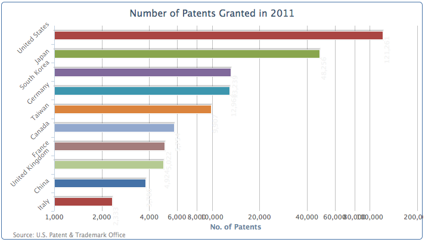
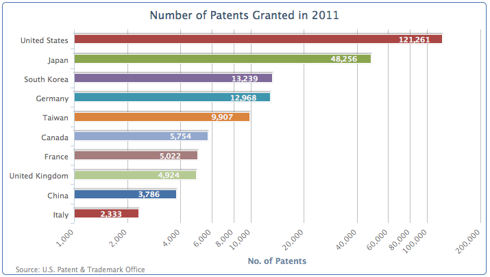
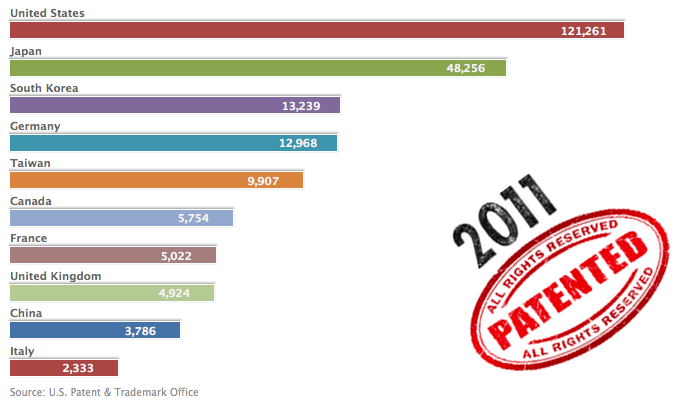

## 条形图介绍

在Highcharts中，有两种条形图的设置方式：一种是将类型设置为'bar'，或者将'inverted'选项设置为true。切换柱状图和条形图是y轴和x轴的简单交换；所有的标签仅仅是旋转了位置。而且，实际的配置也是保持了x和y轴。  
为了证明这一点，我们简单的讲'inverted'选项置为'true'，向下面这样：

```javascript
    chart: {
                .... ,
                type: 'column',
                inverted: true
            },
```

图如：



国家名称和对数坐标轴标签在旋转之后仍保持不变。事实上，现在数值标签和数据序列名称并没有和条形图对其。下一步是重置标签方向，将图形恢复到可读的形式;我们只是将互换从 y 轴与 x 轴的标签设置:

```javascript
    xAxis: {
                categories: [ 'United States', 
                              'Japan', 'South Korea', ... ]
            },
            yAxis: {
                 .... , 
                labels: {
                    rotation: -45,
                    align: 'right'
                }
            },
```

我们将删掉旋转设置，而使用默认的柱状图数据标签设置，并重新调整x和y的坐标让他重新对齐到条形图的条上。

```javascript
    plotOptions: {
                column: {
                    ..... , 
                    dataLabels: {
                        enabled: true,
                        color: '#F4F4F4',
                        x: -40,
                        y: 5,
                        formatter: .... 
                        style: ...
                    }
                }
```

调整之后，条形图会变成这样：


### 简化条形图

让我们回到最简化的状态。删掉整个y轴的配置代码，还有对分类名称的调整。y轴的配置简化为这样：
```javascript
    yAxis: {
        title: {
            text: null
        },
        labels: {
            enabled: false
        },
        gridLineWidth: 0,
        type: 'logarithmic'
    },
```

然后我们移动国家标签到数据条的上方，同时删除坐标轴线和刻度，然后更改标签的对齐方式和他们的 x 和 y 坐标:

```javascript
    xAxis: {
        categories: [ 'United States', 'Japan', 
                      'South Korea', ... ],
        lineWidth: 0,
        tickLength: 0,
        labels: {
            align: 'left',
            x: 0,
            y: -13,
            style: {
                fontWeight: 'bold'
            }
        }
    },
```

由于我们更改标签的对齐到数据条上方，数据条（的绘图区域）的水平位置已经扩展到左边，来填充旧的标签位置。因此我们需要增加左间距以避免图表看起来太拥挤。最后，我们添加背景图像到画布上，用来填充空白的地方，如下所示:

```javascript
    chart: {
        renderTo: 'container',
        type: 'column',
        spacingLeft: 20,
        plotBackgroundImage: 'chartBg.png',
        inverted: true
    },
    title: {
        text:  null 
    },
```

下面这张图就是一个简化之后的条形图：
