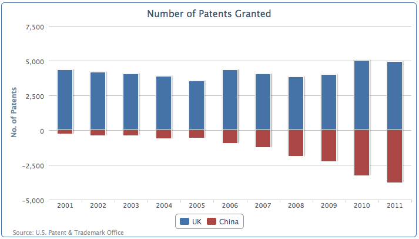
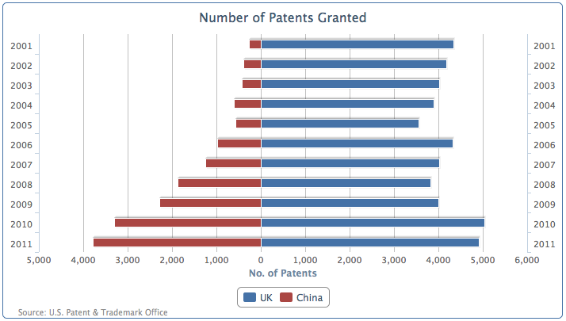
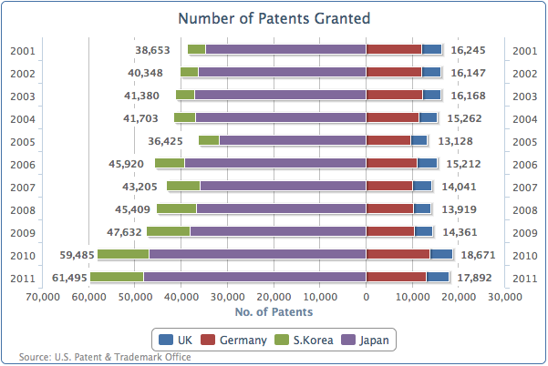

## 构造镜像图表

使用镜像图是比较两个数据序列的另一种方式。与普通柱状图彼此相邻数据列对齐不同，镜像图表将两序列数据对齐在一个坐标轴的两端。有时这种图表是展现两种数据趋势的首选表现方式。

在 Highcharts 中我们可以利用的堆积条形图略加变化，镜子图表用于比较两边水平对齐的数据。让我们开始用新的专利授权数据系列，展示英国和中国在过去十年授权专利数量的对比。

我们配置图表为列堆叠条形图，一组数据为正，另一种设置手动转换为负值，这样的0轴位于图表中间。然后我们将柱状图转化问条形图，然后像正数一样，将负数值也标记为正数。让我们先用正数和人为改变为负数的数据，创建一个堆积图，如下所示:

```javascript
    chart: {
                renderTo: 'container',
                type: 'column',
                borderWidth: 1	
            },
            title: {
                text: 'Number of Patents Granted', 
            },
            credits: { ... },
            xAxis: {
                categories: [ '2001', '2002', '2003', ... ],
            },
            yAxis: {
                title: {
                    text: 'No. of Patents'
                }
            },
            plotOptions: {
                series: {
                  stacking: 'normal'
                }
            },
            series: [{
                name: 'UK',
                data: [ 4351, 4190, 4028, ... ]
                }, {
                name: 'China',
                data: [ -265, -391, -424, ... ]
            }]

```

下面这个截图就是零轴在y轴中间情况：  



然后我们更改配置成条形图， x 轴两边显示相同的范围。最后一步是定义 y 轴标签的格式化函数，可以将负面的标签变成正数的如下所示:

```javascript
    chart: {
             .... ,
             type: 'bar', 
         },
         xAxis: [{
             categories: [ '2001', '2002', '2003', ... ], 
         }, {
             categories: [ '2001', '2002', '2003', ... ],
             opposite: true,
             linkedTo: 0, 
         }],
         yAxis: {
             .... ,
             labels: {
                 formatter: function() {
                    return
                Highcharts.numberFormat(Math.abs(this.value), 0); 
                 }
             }
         },

```

这是最后的效果图，展示了最近十年来，中国和英国专利授予数量的变化。



### 扩展为堆叠的镜像图

我们还可以同样使用在堆叠图中使用的分组的规则。堆积柱形图除了显示为彼此相邻的两个数据柱分组，我们可以有堆积与零值来对称绘制两个组的所有堆叠柱。下面的截图展示了使用分组堆积镜像图，对比欧洲和亚洲的堆叠组之间的数据:



The South Korean and Japanese series are stacked together on the left-hand side (the negative side), whereas the UK and Germany are grouped on the right-hand side (the positive side). The only tricky bit to producing the preceding graph is how to output the data label boxes.
韩国和日本的数据堆叠在左边（负数区域），英国和德国的分组在右侧（正数区域）。只有在处理数据标签的时候，需要一点技巧。
First of all, the South Korean and Japanese series data is manually set to negative values. Secondly, since South Korea and the UK are both the outer series of their own group, we enable the data label for these series. The following code snippet shows the series array configuration:
首先，韩国和日本的数据是手动设置为负数值的。其次，韩国和英国是它们所在分组的外侧数据序列，我们可以标记这些数据：

```javascript
    series: [{
        name: 'UK',
        data: [ 4351, 4190, 4028, ... ],
        dataLabels : {
            enabled: true,
            backgroundColor: '#FFFFFF',
            x: 40,
            formatter: function() {
                return Highcharts.numberFormat(Math.abs(this.total), 0); 
            },
            style: {
                fontWeight: 'bold'
            }
        }
    }, {
        name: 'Germany',
        data: [ 11894, 11957, 12140, ... ], 
    }, {
        name: 'S.Korea',
        data: [ -3763, -4009, -4132, ... ],
        dataLabels : {
            enabled: true,
            x: -48,
            backgroundColor: '#FFFFFF',
            formatter: function() {
                return Highcharts.numberFormat(Math.abs(this.total), 0); 
            },
            style: {
                fontWeight: 'bold'
            }
        }
    }, {
        name: 'Japan',
        data: [ -34890, -36339, -37248, ... ], 
    }]
```

注意，格式化函数中使用的是this.total而不是this.y， 因为我们使用的是外侧数据列，来打印他们分组的数据综合。白色背景设置数据标签，是为了避免纵轴插入到数据标签中，影响阅读。