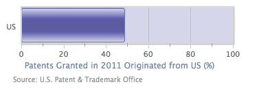

## 将单条条形图转换成水平仪表图

仪表图通常是用来表示当前的阈值水平的指示标志，意味着y轴是固定的，当前数据在x轴只有一个数据。

接下来我们将要学习如何与单个条形图表变成的仪表指针图表。基本的想法是减少绘图区的大小到条形图的条差不多的大小。这意味着我们必须固定大小的绘图区和数据条，忽略容器的尺寸。为此我们将设置 chart.width 和 chart.height 的值。然后我们装饰绘图区的边框和背景的颜色，使它看起来像一个指针式仪表图:

```javascript
            chart: {
                renderTo: 'container',
                type: 'bar',
                plotBorderWidth: 2,
                plotBackgroundColor: '#D6D6EB',
                plotBorderColor: '#D8D8D8',
                plotShadow: true,
                spacingBottom: 43,
                width: 350,
                height: 120 
            },
```

然后我们关闭y轴的轴标题，设置固定间隔，如下：

```javascript
            xAxis: {
                categories: [ 'US' ],
                tickLength: 0
            },
            yAxis: {
                title: {
                    text: null
                },
                labels: {
                    y: 20
                },
                min: 0,
                max: 100,
                tickInterval: 20,
                minorTickInterval: 10,
                tickWidth: 1,
                tickLength: 8,
                minorTickLength: 5,
                minorTickWidth: 1,
                minorGridLineWidth: 0
            },
```

最后，我们配置数据条，条的宽度适应绘图区域的大小。数据序列使用SVG渐变效果填充，像这样：

```javascript
            series: [{
               borderColor: '#7070B8',
               borderRadius: 3,
               borderWidth: 1,
               color: {
                   linearGradient: 
                       { x1: 0, y1: 0, x2: 1, y2: 0 },
                   stops: [
                   			[ 0, '#D6D6EB' ],
                            [ 0.3, '#5C5CAD' ],
                            [ 0.45, '#5C5C9C' ],
                            [ 0.55, '#5C5C9C' ],
                            [ 0.7, '#5C5CAD' ],
                            [ 1, '#D6D6EB'] ]
               },
               pointWidth: 50, 
               data: [ 48.9 ]
            }]
```

>  SVG支持多级的渐变，但是VML不行。所以在使用VML浏览器，比如IE8的时候，渐变的级数应该控制在两级。	

下面是最终的仪表指示图的效果：

