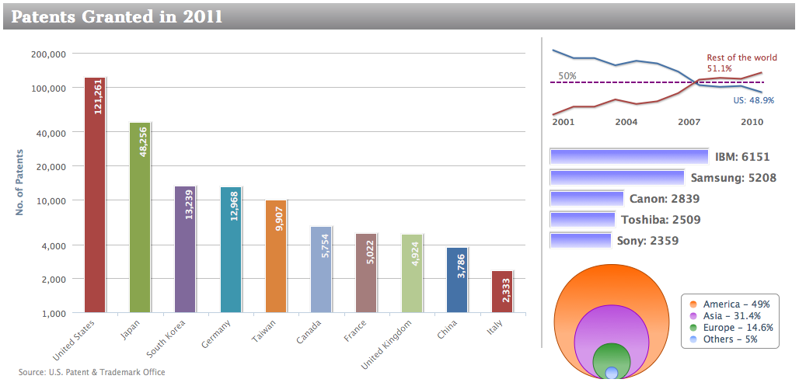

## 绘制复合图表

在这一节中，我们将构建一个混合的图表。左手边是主要图表，右手边从上到下有三个小图。布局使用div和css样式。

左边的图，是一个彩色的柱状图，和我们前面讨论的一样。小图里面的坐标轴和数据标签都将被隐藏。

第一个小图，是两个数据序列，只显示最后一个数据点的数据标签，所以最后一个数据点需要特殊处理。数据标签的颜色和数据序列的相同。在50%的位置绘制一条标志线。下面这个代码片段是两个数据序列之中的一个：

```javascript
            pointStart: 2001,
            marker: {
                 enabled: false
            },
            data: [ 53.6, 52.7, 52.7, 51.9, 52.4, 
                    52.1, 51.2, 49.7, 49.5, 49.6, 
                    { y: 48.9,
                      name: 'US',
                      dataLabels: {
                          color: '#4572A7',
                          enabled: true,
                          x: -10,
                          y: 14,
                          formatter: function() {
                              return 
                   this.point.name + ": " + this.y + '%';
                          }
                      }
                  }]
```

第二个小图，是一个简单的条形图，数据标签在分类外面，使用稍大一些的粗体字。

最后一个小图，是一个简单的散点图，每一个数据绘制一个点，每个系列展示在右边图例中。我们将为每个系列的 x 值设置为零，这样我们可以有不同大小的数据点，相互堆叠。下面是散点图中，其中一个数据系列的配置:

```javascript
               zIndex: 1,
               legendIndex: 0,
               color: {
                   linearGradient: 
                       { x1: 0, y1: 0, x2: 0, y2: 1 },
                         stops: [ [ 0, '#FF6600' ],
                                  [ 0.6, '#FFB280'  ] ] 
               },
               name: 'America - 49%',
               marker: {
                   symbol: 'circle',
                       lineColor: '#B24700',
                       lineWidth: 1
               },
               data: [ 
                   { x: 0, y: 49, name: 'America', 
                     marker: { radius: 74 } 
               } ]
```

下面是多个图片展示在同一个图表中的效果图：

