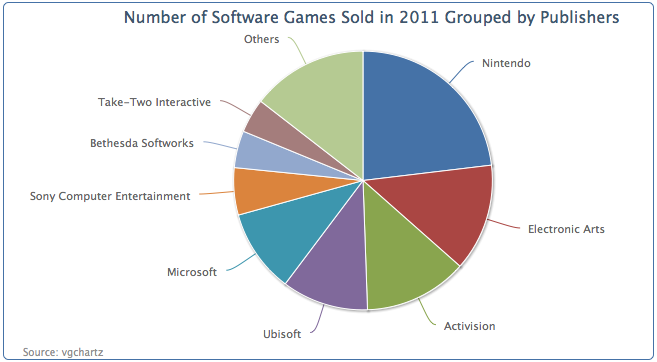
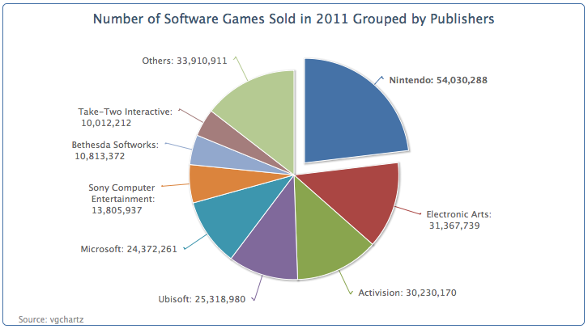
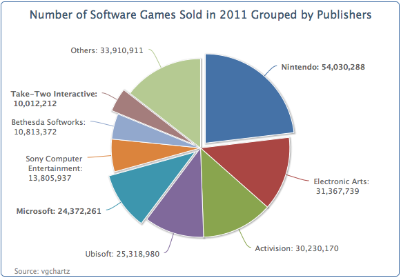
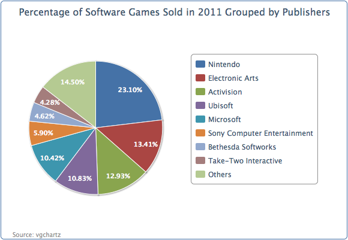

## 绘制单饼图 —— 单个数据序列

本节中，我们将使用vgchartz (www.vgchartz.com)上的游戏数据。后面的饼图配置和数据是2011年发行的游戏的销售量最多的100个游戏的销售量。Wii体育游戏从数据中去除了，因为在Wii中是可以免费获得的。

```javascript
      chart: {
        renderTo: 'container',
        type: 'pie',
        borderWidth: 1
      },
      title: {
        text: 'Number of Software Games Sold in 2011 Grouped by Publishers',
      },
      credits: { 
        ...
      },
      series: [{
        data: [ [ 'Nintendo', 54030288 ], 
            [ 'Electronic Arts', 31367739 ],
            ... ]
      }]
```

这是一个简单的饼图的示例，第一个数据点（任天堂，Nintendo）起始于12点钟的方向。第一个数据点永远从这里开始，无法改变。



### 配置饼图切片
We can improve the previous pie chart to include values in the labels and word wrap some of the long names of the publisher. Instead of redefining the dataLabels.formatter option, we will predefine a method, formatWithLineBreaks and use it inside the formatter option because we will reuse this method in other examples:
我们可以优化前面的饼图，加入数据标签，发行商名字也可以折行显示。在格式化选项中，我们将预定义一个方法formatWithLineBreaks，取代dataLabels.formatter选项：

```javascript
    function formatWithLineBreaks(str) {
      var words = str.split(' ');
      var lines = [];
      var line = '';

      $.each(words, function(idx, word) {
        if (line.length + word.length > 25) {
          lines.push(line);
          line = '';
        }
        line += word + ' ';
      });
      lines.push(line);
      return lines.join('<br/>');

    }
```

下面是饼图的绘制选项代码。allowPointSelect 允许用户可以点击饼图进行交互。对于这个饼图，我们将从饼中切出一个扇形区域（见下图）。sliceOffset选项就是用来设置这个分割的扇区与饼图之间的距离。

```javascript
   plotOptions: {
     pie: {
       slicedOffset: 20,
       allowPointSelect: true,
       dataLabels: {
         formatter: function() {
           var str = this.point.name + ': ' +          
             Highcharts.numberFormat(this.y, 0);
           return formatWithLineBreaks(str);
         }
       }
     }
   },
```

此外，我们想分离最大的一个扇区，它的数据标签使用粗体显示。为此，我们需要修改最大一个扇区的数据点，想下面这样让这个数据点变成一个对象。然后我们将sliced属性写在这个数据对象中，使用false覆盖默认true值，这将强制分离这个数据扇区。然后，将fontWeight属性也覆写为bold，让数据标签变为粗体字：

```javascript
    series: [{
      data: [ { 
        name: 'Nintendo', 
        y: 54030288, 
        sliced: true, 
        dataLabels: { 
          style: { 
          fontWeight: 'bold' 
          } 
        } 
       }, [ 'Electronic Arts', 31367739 ], 
        [ 'Activision', 30230170 ], .... ]
    }]
```

下图是重新定义过数据标签的图表：



扇区之间的默认距离是10像素，slicedOffset选项已经将分离的扇区移开了更远的一段距离。如果slcedOffset应用于所有的数据分区，将意味着我们我不能控制单独的扇区分离距离。值得注意的一点是，连接扇区和数据标签的断线可能会错位。下一个例子中，我们将sliced属性应用于更多的数据点，删除slicedOffset属性，以恢复为默认数值，来展示这些差别。将上面这个对象（任天堂，Nintendo）的属性复制到其它两个数据中：



注意连接线恢复成了平滑线。但是，另外一个有趣的现象：默认情况下，sliced默认是false，当用户点击其中一个分片的时候，这个分片就会从饼图中被分离出来，其它被分离出来的扇区将回到他们原来的位置；而三个将sliced设置为true的扇区，在点击其它扇区之后，依然保持分离的距离并不会回到中心位置。这意味sliced选项设置为true之后，实际上是将其与其它默认为false的扇区独立开来了。

### 为饼图设置图例

到目前为止，我们的饼图包含一堆巨大的数字；这很难让人只管比较他们之间的差异。我们可以使用百分比的形式展示数据标签。我们将发行商名称放在一个图例栏里面，然后在饼图的扇区中标注它们的百分比。

绘制选项重新定义如下。开启图例栏，设置showInLegend为true。然后设置标签姿态颜色和样式，修改formatter函数，展示百分比。percentage变量智能应用在饼图中。distance选项是设置数据标签和饼图外边缘之间的距离。正数距离，标签在饼图外侧；负数距离，标签将出现在饼图内部。

```javascript
      plotOptions: {
        pie: {
          showInLegend: true,
          dataLabels: {
            distance: -24,
            color: 'white',
            style: {
              fontWeight: 'bold'
            },
            formatter: function() {
              return Highcharts.numberFormat(this.percentage) + '%';
            }          
          }
        }
      },
```

对于图例栏，我们在图例之间加一些填充，再将整个图例栏向饼图靠近：

```javascript
      legend: {
        align: 'right',
        layout: 'vertical',
        verticalAlign: 'middle',
        itemMarginBottom: 4,
        itemMarginTop: 4,
        x: -40
      },
```

绘制完的饼图如下：


