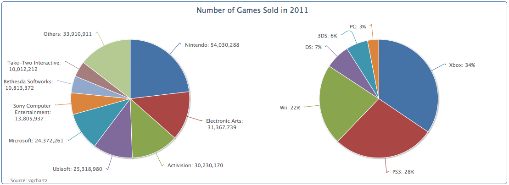

## 绘制多个饼图 —— 多数据序列

我们可以使用多个并列的饼图来比较多个数据序列。这只需要简单的将两个数据序列放到series数组中。

左边的图表我们可以继续使用前面的图表，我们在右侧使用相同的数据重新建立一个数据序列，并按照平台进行分组。像下面这样：
 
```javascript
      series: [{
        center: [ '25%', '50%' ],
        data: [ [ 'Nintendo', 54030288 ], 
            [ 'Electronic Arts', 31367739 ], 
            .... ]
      }, {
        center: [ '75%', '50%' ],
        dataLabels: {
          formatter: function() {
            var str = this.point.name + ': ' + Highcharts.numberFormat(this.percentage, 0) + '%';
            return formatWithLineBreaks(str);
          }
        },
        data: [ [ 'Xbox', 80627548 ], 
            [ 'PS3', 64788830 ], 
            . . . ] ]
      }]
```

我们使用了一个新的选项：center， 用来定位饼图的中心位置。这个选项包含一个数组，数组中有两个值，一个是“x”值，相对于整个容器的宽度；另外一个是“y”轴的位置。默认值是["50%","50%"]， 饼图将位于绘图区的中心。在这个例子中，我们指定“x”位置分别为25%，75%，左右两侧的正中心。
在第二个数据序列中，我们将选择显示百分比数据取代具体数值。下面是包含两个饼图的图表效果：



表面上，绘制两个独立的饼图，和使用<div>标记分别放置两个饼图并没有太大的区别，除了它们共用了统一的标题。我们想要的是在一个饼图中直观对比多个不同的数据序列所占的比例，我们将在本章后面介绍如何实现。