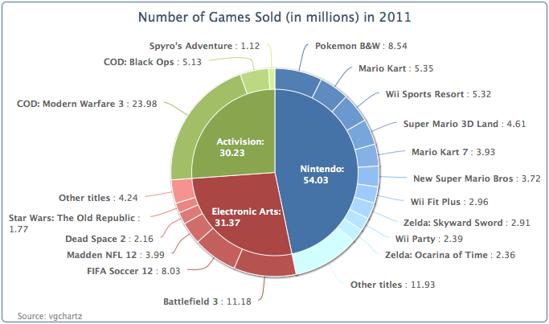
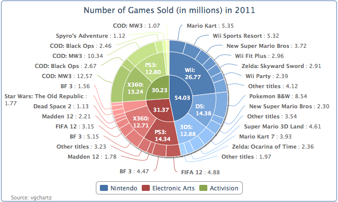

## 准备绘制圆环图

Highcharts提供了另外一种饼图——圆环图。它可以绘制子类别的数据，更好的展现数据的细节。而且子数据序列可以绘制多级。在这一节里，我们将创建一个简单的圆环图，圆环的外圈数据（游戏名称）和内圈数据（发行商）对齐。

简单起见，我们仅绘制前三个游戏发行商的数据在内圈。下面是绘制圆环图的序列配置：

```javascript
      series: [{
        name: 'Publishers',
        dataLabels : {
          distance: -70,
          color: 'white',
          formatter: function() {
             return this.point.name + ':<br/> ' + Highcharts.numberFormat(this.y / 1000000, 2);
          },
          style: {
             fontWeight: 'bold'
          }
        },
        data: [ [ 'Nintendo', 54030288 ], [ 'Electronic Arts', 31367739 ],
            [ 'Activision', 30230170 ] ]
      }, {
        name: 'Titles',
        innerSize: '60%',
        dataLabels: {
          formatter: function() {
            var str = '<b>' + this.point.name  '</b>: ' + High-charts.numberFormat(this.y / 1000000, 2);
            return formatWithLineBreaks(str);
          }
        },
        data: [ // Nintendo
            { name: 'Pokemon B&W', y: 8541422,
             color: colorBrightness("#4572A7",
                        0.05) }, 
            { name: 'Mario Kart', y: 5349103,
             color: colorBrightness('#4572A7',
                        0.1) },
            ....
 
            // EA
            { name: 'Battlefield 3', y: 11178806,
             color: colorBrightness('#AA4643',
                        0.05) }, 
            .... 

            // Activision
            { name: 'COD: Modern Warfare 3', 
             y: 23981182, 
             color: colorBrightness('#89A54E',
                        0.1) },
            ....
        }]
      }]
```

首先，我们有两层数据序列，内层饼图表示发行商，外层圆环表示游戏。游戏名称数据是发行商数据的子分类，同一个发行商的游戏总和应该和内层发行商数据保持对齐。因此子分类的顺序，应该是所有任天堂（Nintendo）的游戏数据位于所有EA发行的游戏的前面，依此类推（参见Title序列的数据数组）。

每一个子序列的数据点，可以赋予一个和他的父序列相近的颜色。可以通过下面的示例这样改变颜色的亮度：
```javascript
color: Highcharts.Color(color).brighten(brightness).get()
```

基本上，使用主要类别颜色值来创建一个Color对象，然后调整亮度参数。此参数可以来自子类别数值的比率。我们改写本示例为一个函数 colorBrightness，并在图表配置中调用它。

```javascript
 function colorBrightness(color, brightness) {
   return   
     Highcharts.Color(color).brighten(brightness).get();
 }
```

接下来，指定那些数据是内部饼图，哪些是外部圆环。外部数据序列Title，将使用innerSize选项，创建一个空心的内圆。这样，Title序列就会展示成一个圆环。innerSize选项可以是像素数值，也可以是绘图区域的百分比。

最后，来放置数据标签。显然我们需要将内部数据标签放到内部饼图上，所以我们给dataLabels.distance选项一个负数距离。为了避免太长的数据值，我们使用formatter方法，把数据单位转换为millions（百万）。
下面就是画好的圆环图：



注意，这并不意味着只能在圆环图的中间画一个饼图。只是我们的例子是这样的。我们可以绘制多个同心圆。下面就是使用前面的数据，只是在内部发行商饼图上也加入了innerSize选项：


我们可以进一步为圆环图加入第三个数据序列。我们绘制一个三层的圆环图。代码是简单的扩展了上面的示例，加入了更多的数据。源代码和演示可以从这里 http://joekuan.org/Learning_Highcharts/ 获取。外面两个圆环图设置了innerSize，内部饼图因为变得更小，而没有足够的空间展示数据标签，所以我们使用showInLegend选项，把最内层的数据标签移到饼图外面的图例栏当中。
 

