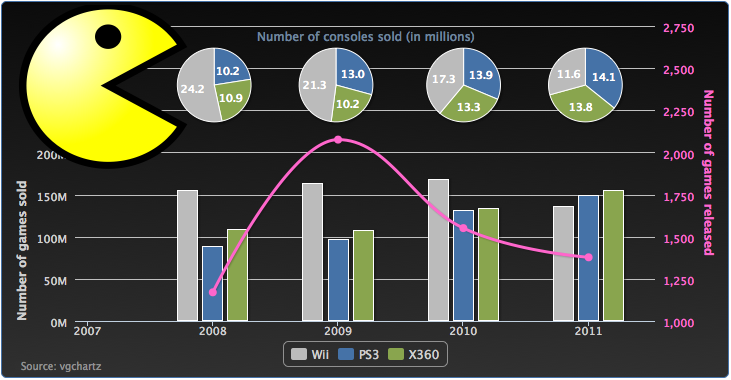
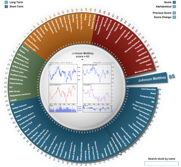
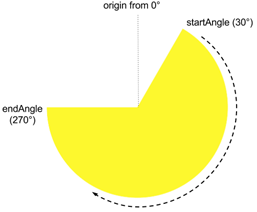
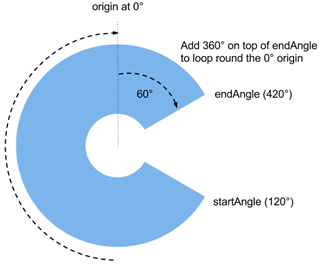
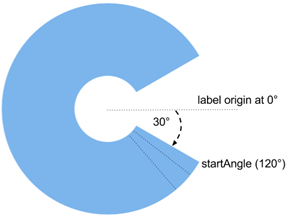
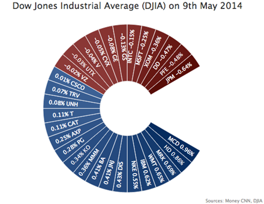

## 绘制多数据序列图表

到目前为孩子，我们已经学习了折线图，柱状图和饼图。现在是时候使用这些表现形式绘制一个综合的图表了。这一届，我们使用2008到2011年的数据，绘制三种不同的图——柱状图，折线图和饼图。柱状图展现每年游戏的销售量。饼图用来展示每个提供商的销售占比。最后一个曲线图是展示每年新游戏数量的变化趋势。

为了将整个图表中每个游戏平台的颜色统一，我们需要为每个游戏平台指定一个颜色：
```javascript
    var wiiColor = '#BBBBBB';
    var x360Color = '#89A54E';
    var ps3Color = '#4572A7';
    var splineColor = '#FF66CC';
```

我们稍后会美化整个图表。首先，我们为背景铺上一层渐变颜色：
```javascript
    var chart = new Highcharts.Chart({
      chart: {
        renderTo: 'container',        
        borderWidth: 1,
        spacingTop: 40,
        backgroundColor: {
          linearGradient: { x1: 0, y1: 0, 
                   x2: 0, y2: 1 },
          stops: [ [ 0, '#0A0A0A' ],
               [ 1, '#303030' ] ]
        }
      },
```

然后我们移动柱状图到右边，空出左上角的位置留给一个图片（后面会提到）。

```javascript
      xAxis: {
        minPadding: 0.2,
        tickInterval: 1,
        labels: {
          formatter: function() {            
            return this.value;
            },  
          style: {
           color: '#CFCFCF'
          } 
        }
      }
```

下一个任务是创建足够的空间给饼图，让饼图可以放置在柱状图的上面。可以通过下面设置y轴的maxPadding方式完成：

```javascript
      yAxis: [{
        title: {
          text: 'Number of games sold',
          align: 'low',
          style: {           
            color: '#CFCFCF'
          }
        },
        labels: {
          style: {
           color: '#CFCFCF'
          }
        },
        maxPadding: 0.5
      }, {
        title: {
          text: 'Number of games released',
          style: {           
           color: splineColor
          } 
        },
        labels: {
          style: {
           color: splineColor
          } 
        },
        maxPadding: 0.5,
        opposite: true
      }],
```

每一个饼图都是一个独立的饼图，并且和下面的柱状图对齐，也是和下面的年份对齐。这个可以调整center设置饼图的中心位置来确定。我们还需要减少饼图的尺寸，好让图的其他部分也能放到绘图区里。我们将设置size选项，设置size的百分比属性。这个百分比，是指饼图相对于绘图区域的比例：

```javascript
      series:[{
        type: 'pie',
        name: 'Hardware 2011',
        size: '25%',
        center: [ '88%', '20%' ],
        data: [{ name: 'PS3', y: 14128407, 
             color: ps3Color }, 
            { name: 'X360', y: 13808365, 
             color: x360Color }, 
            { name: 'Wii', y: 11567105, 
             color: wiiColor } ],
        .....
```

曲线的坐标定义在y轴的另外一边。为了能更清楚的表现第二坐标系，我们为线、坐标轴和标签都指定一个新的颜色：
```javascript
      {  name: "Game released",
        type: 'spline',
        showInLegend: false,
        lineWidth: 3,
        yAxis: 1,
        color: splineColor,
        pointStart: 2008, 
        pointInterval: 1,
        data: [ 1170, 2076, 1551, 1378 ]
      }, 
```

我们使用renderer.image方法，将一个图片插入到图表当中，并且在z轴上位于上层，这月坐标轴的线就不会展示在图片上面了。我们使用svg图取代png。这种图片可以保持边界清晰避免在图表拉伸过程中，图片像素化。

```javascript
    chart.renderer.image('./pacman.svg', 0,
               0, 200, 200).attr({
       'zIndex': 10 
    }).add();
```

下面这是插入一幅吃豆人图片之后，整个游戏图表数据的样子：



### 创建股票大转盘
股票转盘图是一个经济图表，由投资者情报 (http://www.investorsintelligence.co.uk/wheel/) 创建，图标提供交互方式展示股票市场指数的概况和细节。下面就是一幅股票转盘：
 


基本上，它是"开放式"的圆环图表。每个扇区表示蓝筹公司，所有扇区宽度都相等。基于股票表现的得分，每个扇区分属不同的颜色带 (从红色，橙色，绿色，蓝色) 。当用户将鼠标悬停在公司名称上时，会出现更大的扇区，公司名称和股票细节。虽然这令人印象深刻的图表是使用 Adobe Flash 实现的，然而现在，我们要试试运气，看看Highcharts 是否也可以绘制如此的报表。我们重点关注圆环图的实现，圆环中间的图表作为练习留给读者。

### 理解起始角和终止角

当我们开始绘制股票转盘时，我们需要知道如何绘制一个不封闭的圆环。startAngle 和 endAngle选项可以绘制一个开放的饼图，从一个指定角度到任意其他角度的扇形图。但是我们需要先熟悉一下这些选项。默认状态下，第一个扇区的起始角度是12点钟方向，12点钟也是起始角为0°的位置。startAngle选项从这个起始点开始，顺时针方向到达终止角度。让我们绘制一个startAngle和endAngle分别为30°和270°的饼图：
```javascript
            plotOptions: {
               pie: {
                   startAngle: 30,
                   endAngle: 270 
               }
            },
```

可以得到下面这个图。 值得注意的是，虽然数据相对应的饼图变小了，数据占比其实也会按比例调整。
 


为了在饼图的右手边留出一个间隙，endAngle需要做一些小的调整。endAngle在startAngle之上，比如endAngle旋转一周之后通过原点（0°轴），endAngle就超过了360°，不会从0°再绘制一次。让我们设置扇形的startAngle和endAngle为120°和240°，并且增大内径，变成一个扇形环。下面就是新的配置：

```javascript
            plotOptions: {
                pie: {
                    startAngle: 120,
                    endAngle: 420,
                    innerSize: 110,
                    …..
                }
           } 
```

这样我们看到结束角度通过了原点，而且在起始角度之上了。像下面这样：



### 为股票创建分片

到这里，我们已经成功创建了股票转盘的主要部分。下一项任务是在每一个相等的分片上，标注财务数据。我们采用道琼斯工业平均指数中的30中主要股票，替代原图中富时指数的100只股票。熟悉，我们创建一个数据数组，包括股票代码，并使用百分比倒序排列。

```javascript 
          var data = [{
                name: 'MCD 0.96%',
                y: 1,
               dataLabels: { rotation: 35 },
               color: colorBrightness('#365D97', ratio1)
          }, {
               name: 'HD 0.86%',
               y: 1,
              dataLabels: { rotation: 45 },
              color: colorBrightness('#365D97', ratio2)
          }, {
              ....
          }]
```

给Y轴指定的值为1， 这样每一个股票都会有一个相同大小的分片扇区。然后我们通过股票百分比变化来改变颜色亮度，到达颜色渐变的效果。

当我们知道在哪里旋转，旋转多少度的时候，我们就可以计算出每个股票代码的位置了。文本的原始起始角度是三点钟方向，（因为我们习惯水平阅读文字）。起始角为120都，所以我们可以计算出第一个扇区上数据标签的旋转角度是30°（我们在加5°偏移，让他位于扇区的中心位置）其他扇区每个依次在前一个旋转角度上增加10°。下面这个图可以说明这些角度是如何计算的：


下一个任务是去掉连接线，把默认的标签位置向饼图中心移动（默认在外侧）。设置连接线的宽度为0，给标签距离一个负数值，让它向圆心移动，直到把标签移到扇区的内部。下面这是plotOptions.pie的配置：

```javascript
  plotOptions: {
     pie: {
    size: '100%',
    startAngle: 120,
    endAngle: 420,
    innerSize: 110,
    dataLabels: {
        connectorWidth: 0,
        distance: -40,
        color: 'white',
        y: 15
    },
```

下面的截图就是旋转并移动标签之后的股票转盘的效果：

